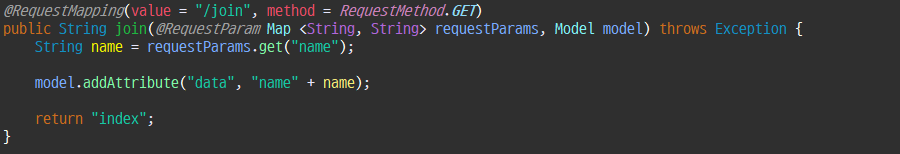
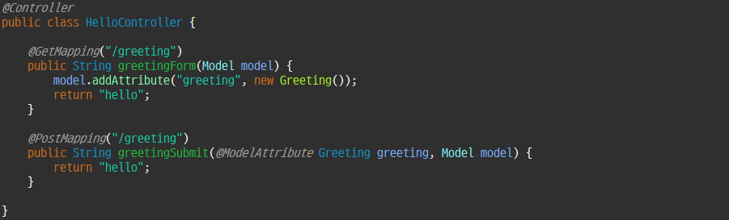
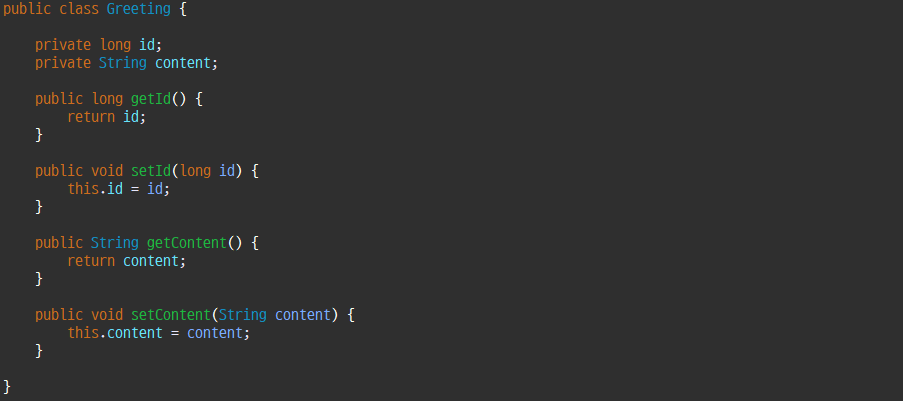
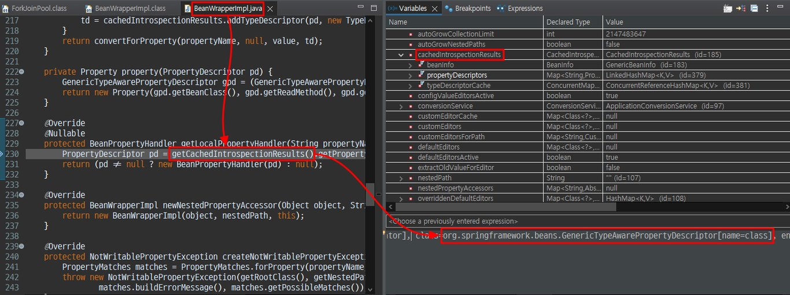
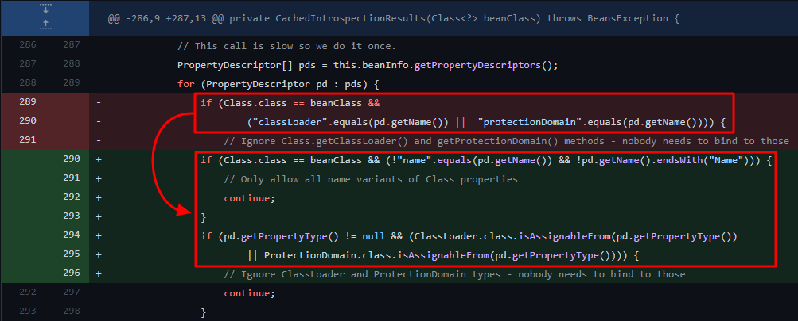
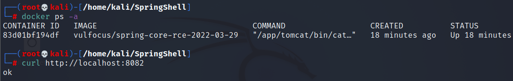
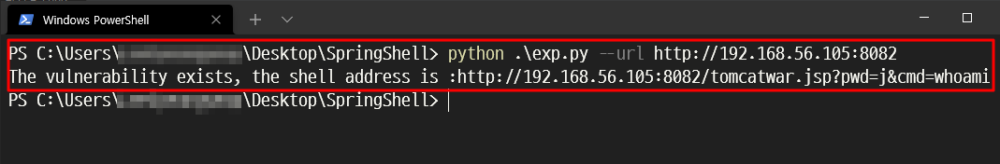
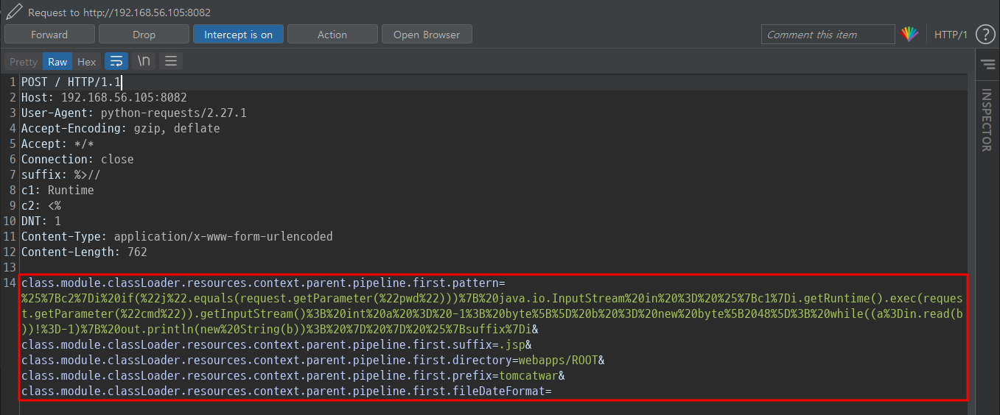
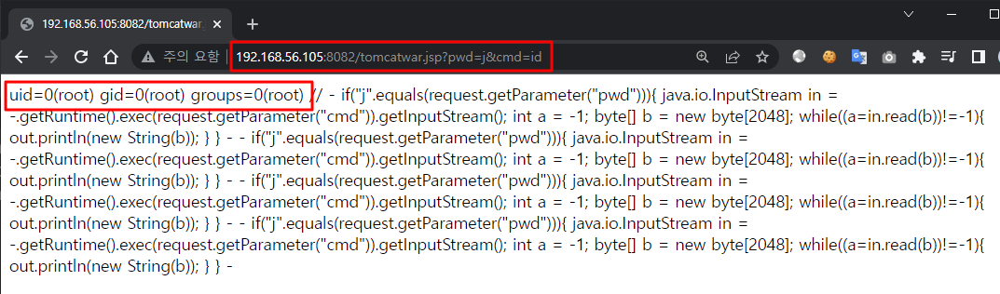

 
 여러 글을 정리하여 옮겼습니다 😀

# 😸01 Summary
중국의 한 보안 전문가가 올린 Spring Core 프레임워크 취약점 POC 화면이 발단이 되어 여러 POC가 웹 상에 올라왔습니다. 해당 취약점은 "Spring4Shell" 또는 "SpringShell"로 불리며 2022년 03월 31일 Spring 개발자에 의해 'CVE-2022-22965' 취약점으로 추가되었습니다.

Spring4Shell 취약점은 Spring Core 프레임워크에서 특정 조건 하에 Remote Code Execution이 가능한 취약점이며 Spring 프레임워크가 매개변수를 바인딩하는 과정에서 'class' 객체가 노출되어 발생합니다. 
공격자는 해당 'class' 객체의 자식 객체인 'class.module.classLoader'에 웹 매개변수를 통해 접근할 수 있으며 로깅 관련 클래스(AccessLogValve)를 이용하여 웹 쉘 코드를 업로드한 후, 명령어를 실행할 수 있습니다.

> 취약 조건
- Java 9 이상
- Apache Tomcat 서버
- Spring Framework 버전 5.3.0 ~ 5.3.17, 5.2.0 ~ 5.2.19 및 이전 버전
- spring-webmvc 또는 spring-webflux 종속성
- WAR 형태로 패키징

사실, 비교되는 'Log4Shell'에 비해 취약 조건이 까다롭지만 취약점 공격 방법이 매우 쉬우므로 여건이 된다면 패치를 하는 것이 좋을 것으로 판단됩니다.

# 😽02 Concept
Spring4Shell 취약점은 매개변수를 바인딩 할 때 발생합니다. 그러면 Spring에서의 매개변수 바인딩과 접근이 어떤 형태로 이뤄지며 어떤 과정에서 취약점이 도출되는지 알아보겠습니다.
## 02-01 매개변수 바인딩 및 접근
Spring Core에서는 _@RequestMapping_ Annotation을 이용해 매개변수를 바인딩 및 접근하는 2가지 방법이 존재합니다.

#### '키-값' 쌍으로 구성된 Map을 이용
아래 캡처와 같이 Map에서 매개변수에 접근할 수 있으며 매개변수의 값은 'model.data'라는 Model Object에 저장되어 사용됩니다.


#### POJO(Plain Old Java Object)를 이용
POJO(Plain Old Java Object)라고 불리는 일반 자바 객체의 속성에 URL을 통해 입력된 매개변수가 매핑되어 사용될 수 있습니다.

아래 캡처에서 매개변수는 'Greeting.greeting' 객체의 속성에 바인딩되며, 실제 요청이 오면 'Greeting' 타입의 인스턴스에 접근하여 속성을 사용할 수 있습니다.


아래와 같이 getter, setter를 이용해 매개변수에 접근할 수 있습니다.



## 02-02 취약점
해당 취약점은 특정 상황에서 **'class'** 라는 특수한 변수가 사용자에게 노출되어 **'classLoader'** 에 접근할 수 있을때 발생하며 상세한 절차는 다음과 같습니다.

1. 웹 어플리케이션 이용자가 매개변수를 사용하는 페이지에 접근합니다.
2. 어플리케이션은 요청 매개변수를 POJO에 바인딩하기 위해 **"getCachedIntrospectionResults"** 라는 메소드를 호출한 후 캐시의 Object 속성을 가져옵니다. _(이때 POJO는 @RequestBody annotation이 적용되어 있지 않아야 합니다.)_
3. 반환된 Object에는 'class' 가 포함되어 있어 사용자는 'class' 객체를 원격에서 사용할 수 있게 됩니다.
4. 이용자는 요청 패킷 매개변수에 'class'의 자식 객체인 'class.module.classLoader'와 로깅 관련 클래스(AccessLogValve)를 입력, 전송하여 객체를 이용할 수 있습니다. Spring Core 프레임워크에서 필터링하는 객체를 우회하여 사용해야 합니다.



패치 전에는 'class'의 자식 객체에 대한 직접 접근을 필터링하기 위해 **'CachedIntrospectionResults.java'** 에서 아래와 같이 **'class.classLoader'** 및 **'class.protectionDomain'** 을 필터링을 하였었지만 **'class.module.classLoader'** 을 사용하여 우회 가능하였습니다.
```java
if (Class.class == beanClass &&
    ("classLoader".equals(pd.getName()) || "protectionDomain".equals(pd.getName()))) {
        continue;
}
```
## 02-03 패치 전후 비교
Spring 개발자에 의해 패치가 되어 **'CachedIntrospectionResults.java'** 가 아래와 같이 수정되었습니다.


# 😾03 Exploit
#### 1. 취약한 도커 이미지 실행
```bash
docker run -d -p 8082:8080 --name springrce -it vulfocus/spring-core-rce-2022-03-29
```


#### 2. POC 실행
POC 실행 시 취약한 서버에 웹쉘이 생성됩니다.


POC 요청 패킷의 매개변수에 'class'의 로깅 관련 객체가 사용되는 것을 확인할 수 있습니다.
'class.module.classLoader.resources.context.parent.pipeline.first.pattern' 매개변수에 웹쉘의 코드를 담고 있습니다.

#### 3. 웹쉘 접속 & 명령어 실행
아래 URL에 접속 시 _id_ 명령어가 실행되어 결과가 출력됩니다.
```http://192.168.56.105:8082/tomcatwar.jsp?pwd=j&cmd=id```

# 😺04 Vulnerable Version
[KISA 권고 사항](https://www.krcert.or.kr/data/secNoticeView.do?bulletin_writing_sequence=66592) 인용
> - JDK 9 이상의 Spring 프레임워크 사용하는 경우
- Spring Framework 5.3.0 ~ 5.3.17, 5.2.0 ~ 5.2.19 및 이전 버전
###### ※ JDK 8 이하의 경우 취약점의 영향을 받지 않음

#### Spring4Shell 버전 확인 방법
JDK 버전 확인: 아래 명령 입력
```bash
java -version
```
#### Spring 프레임워크 사용 유무 확인
프로젝트가 jar, war 패키지로 돼 있는 경우 zip 확장자로 변경하여 압축풀기
이후 아래와 같이 'spring-beans-.jar', 'spring.jar', 'CachedIntrospectionResuLts.class' 로 검색
```bash
find . -name spring-beans*.jar
```
# 😻05 Mitigation
[KISA 권고 사항](https://www.krcert.or.kr/data/secNoticeView.do?bulletin_writing_sequence=66592) 인용

1. 제조사 홈페이지를 통해 최신버전으로 업데이트 적용
Spring Framework 5.3.18, 5.2.20 버전으로 업데이트 [[링크]](https://spring.io/blog/2022/03/31/spring-framework-rce-early-announcement)
※ 제조사 홈페이지에 신규버전이 계속 업데이트되고 있어 확인 후 업데이트 적용 필요
2.  신규 업데이트가 불가능할 경우 아래와 같이 조치 적용
프로젝트 패키지 아래 해당 전역 클래스 생성 후 재컴파일(테스트 필요)
```java
import org.springwork.core.Ordered;
import org.springwork.core.annotation.Order;
import org.springwork.web.bind.WebDataBinder;
import org.springwork.web.bind.annotation.ControllerAdvice;
import org.springwork.web.bind.annotation.InitBinder;
 
@ControllerAdvice
@Order(10000)
public class BinderControllerAdvice {
@InitBinder
public setAllowedFields(WebDataBinder dataBinder) {
String[] denylist = new String[]{"class.*", "Class.*", "*.class.*", "*.Class.*"};
dataBinder.setDisallowedFields(denylist);
}
}
```


# 📖06 References
[1] https://www.extrahop.com/company/blog/2022/a-technical-analysis-of-how-spring4shell-works/
[2] https://unit42.paloaltonetworks.com/cve-2022-22965-springshell/
[3] https://github.com/spring-projects/spring-framework/commit/002546b3e4b8d791ea6acccb81eb3168f51abb15
[4] https://github.com/lunasec-io/lunasec/blob/master/docs/blog/2022-03-30-spring-core-rce.
mdx#who-is-impacted
[6] https://www.krcert.or.kr/data/secNoticeView.do?bulletin_writing_sequence=66592
[7] https://github.com/TheGejr/SpringShell
[8] https://www.lunasec.io/docs/blog/spring-rce-vulnerabilities/