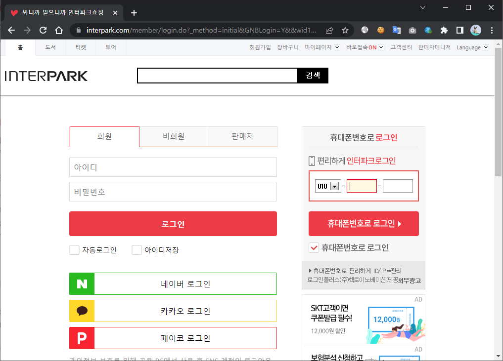
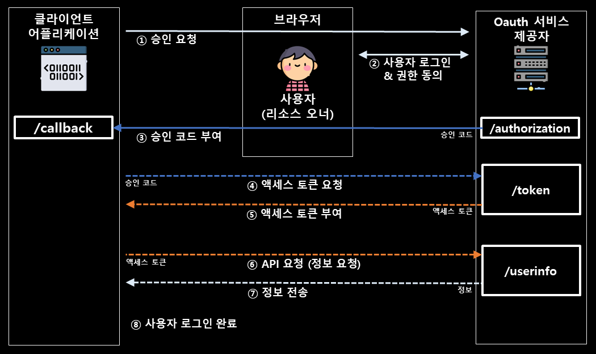
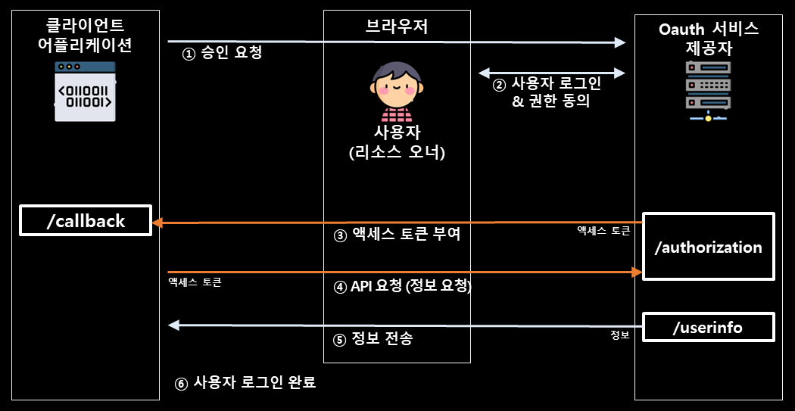

[PortSwigger](https://portswigger.net/web-security/oauth/grant-types)의 글을 번역하였습니다 😀

# 📌 01. OAuth 2.0 이란?
**OAuth 2.0**("**O**pen **Auth**orization 2.0")는 인터넷 사용자들이 비밀번호를 제공하지 않고 다른 웹사이트 상의 자신들의 정보에 대해 웹사이트나 애플리케이션의 접근 권한을 부여할 수 있는 공통적인 수단으로서 사용되는, 접근 위임을 위한 표준입니다.

OAuth를 이용하면 아래 그림과 같이 네이버, 카카오오, 페이코 등 타 서비스를 이용하여 로그인을 할 수 있습니다. 또한 가입 시에도 타 서비스를 이용하여 정보를 제공하고 가입을 할 수도 있습니다.




## 01-01. OAuth 2.0 구성 요소
-   **클라이언트 어플리케이션** : 사용자 데이터에 액세스하려는 웹사이트 또는 웹 애플리케이션
  (가입하려는 사이트)
-   **리소스 오너** : 클라이언트 애플리케이션이 액세스하려는 데이터의 사용자
  (사용자)
-   **OAuth 서비스 제공자** : 사용자 데이터 및 액세스를 제어하는 웹사이트 또는 애플리케이션. 인증 서버 및 리소스 서버로 이루어져 있으며, 이 둘과 상호 작용하기 위한 API를 제공하여 OAuth를 지원합니다.
  (구글, 카카오톡, 페이스북 등)

## 01-02. OAuth 권한 부여 방법
OAuth를 이용하여 정보 요청 시에는 기본적으로 아래와 같은 과정을 거치게 됩니다.

1. **클라이언트 어플리케이션**이 **OAuth 서비스 제공자**에게 필요한 정보 및 각종 파라미터를 요청을 보냅니다.

2. **OAuth 서비스 제공자**는 **리소스 오너**에게 로그인과 권한/정보 제공 동의 요청을 합니다.

3. **리소스 오너**가 동의 시 **OAuth 서비스 제공자**자**는 **클라이언트 어플리케이션**에게 인증 코드 또는 토큰을 부여하여 이후에 정보 요청 및 검증에 사용되게 됩니다.

4. 인증 코드의 경우, **클라이언트 어플리케이션**과 **OAuth 서비스 제공자** 간 서버 대 서버 통신으로 토큰 부여 과정을 거치게됩니다.

5. 이후에는 **클라이언트 어플리케이션**이 **OAuth 서비스 제공자**에게 API를 통해 정보를 요청하고 받을 수 있게됩니다.

위와 같은 과정을 거치는 OAuth에는 2가지 권한 부여 방법이 존재합니다. 

### **🎫 승인 코드 부여 방식**



**① 승인 요청** : 클라이언트 어플리케이션이 특정 사용자 데이터에 접근할 수 있는 권한을 `/authorization` 과 같은 엔드 포인트로 요청합니다. 보통 요청 URL은 아래와 같은 형식을 가집니다.
```
GET /authorization?client_id=12345&redirect_uri=https://client-app.com/callback&response_type=code&scope=openid%20profile&state=ae13d489bd00e3c24 HTTP/1.1 Host: oauth-authorization-server.com
```
각 파라미터의 용도는 아래와 같습니다.
- **client_id** : 클라이언트 응용 프로그램의 고유 식별자를 포함하는 필수 매개 변수입니다. 이 값은 클라이언트 응용 프로그램이 OAuth 서비스에 등록할 때 생성됩니다.
- **redirect_uri** : 권한 부여 코드를 클라이언트 응용 프로그램으로 보낼 때 사용자의 브라우저를 리디렉션해야 하는 URI입니다. 많은 OAuth 공격은 이 매개 변수 유효성 검사의 헛점을 이용합니다.
- **response_type** : 권한 부여 방법을 정합니다. 승인 코드 부여 방식은 `code`  값을 부여합니다.
- **scope** : 요청 권한의 범위를 정합니다. OpenID와 같은 표준화된 범위를 쓰기도 합니다.
- **state** : CSRF 방지 토큰과 같이 사용하여 요청이 동일한 사용자로부터 온 것인지 고유한 값을 이용해 검증합니다.

**② 사용자 로그인 및 동의** :  사용자를 인증하기 위해 로그인을 요청하고 요청하는 권한과 정보에 대해 동의를 요청합니다.

**③ 승인 코드 부여** : 사용자가 동의하면 OAuth 서비스 제공자는 사용자의 브라우저를 권한 부여 요청의 `redirect_uri` 에 지정된 엔드포인트로 리디렉션 시킵니다. 요청 URL에는 승인 코드가 매개 변수로 포함되며 구성에 따라 승인 요청과 동일한 값의 state 매개 변수를 보낼 수도 있습니다.
```
GET /callback?code=a1b2c3d4e5f6g7h8&state=ae13d489bd00e3c24 HTTP/1.1
Host: client-app.com
```

**④ 엑세스 토큰 요청** : 클라이언트 어플리케이션이 승인 코드를 받으면 액세스 토큰으로 교환합니다. 이를 위해 OAuth 서비스의 `/token`  엔드포인트에 서버 대 서버 POST 요청을 보냅니다. 서버 대 서버 요청은 외부에서는 보거나 변조할 수 없습니다.
```
POST /token HTTP/1.1 Host: oauth-authorization-server.com
…
client_id=12345&client_secret=SECRET&redirect_uri=https://client-app.com/callback&grant_type=authorization_code&code=a1b2c3d4e5f6g7h8
```
각 파라미터의 내용은 아래와 같습니다.
- **client_secret** : 클라이언트 어플리케이션이 OAuth 서비스에 등록할 때 할당된 비밀키
- **grant_type** : "/token" 엔드포인트에 권한 부여 유형을 알립니다. 여기서는 "authorization_code"를 사용합니다.

**⑤ 엑세스 토큰 부여** : 클라이언트 어플리케이션이 유효하다면, 서버에서 아래와 같이 토큰을 부여받습니다.
```
{
	"access_token": "z0y9x8w7v6u5", 
	"token_type": "Bearer", 
	"expires_in": 3600,
	"scope": "openid profile",
	… 
}
```

**⑥ API 요청 (정보 요청)** : 클라이언트 어플리케이션은 `Authorization: Bearer` 헤더에 엑세스 토큰을 담아 `/userinfo`  엔드포인트에 사용자 정보를 요청합니다. 이때의 엔드포인트는 어플리케이션에 따라 다를 수 있습니다.
```
GET /userinfo HTTP/1.1 
Host: oauth-resource-server.com 
Authorization: Bearer z0y9x8w7v6u5
```

**⑦ 정보 전송** : 사용자의 정보를 가진 리소스 서버는 받은 토큰이 유효하면 요청받은 정보를 클라이언트 어플리케이션으로 전송합니다.
```
{ 
	"username":"carlos", 
	"email":"carlos@carlos-montoya.net",
	… 
}
```

### **🎫 암시적 부여 방식**


**① 승인 요청** : 클라이언트 어플리케이션이 특정 사용자 데이터에 접근할 수 있는 권한을 `/authorization` 과 같은 엔드 포인트로 요청합니다. 보통 요청 URL은 아래와 같은 형식을 가집니다.
```
GET /authorization?client_id=12345&redirect_uri=https://client-app.com/callback&response_type=token&scope=openid%20profile&state=ae13d489bd00e3c24 HTTP/1.1 Host: oauth-authorization-server.com
```
각 파라미터의 의미는 승인 코드 부여 방식과 동일하며 암시적 부여 방식에서는 response_type을 `token` 설정합니다.

**② 사용자 로그인 및 동의** :  사용자를 인증하기 위해 로그인을 요청하고 요청하는 권한과 정보에 대해 동의를 요청합니다.

**③ 액세스 토큰 부여** : 사용자가 동의하면 OAuth 서비스 제공자는 사용자의 브라우저를 권한 부여 요청의 `redirect_uri` 에 지정된 엔드포인트로 리디렉션시킵니다. 요청 URL에는 액세스 토큰이 URL 조각 형식으로 포함되어 있습니다. 액세스 토큰은 URL 조각으로 전송되므로 클라이언트 어플리케이션 측에서는 알 수 없으며 사용자는 JavaScript 등 을 이용하여 브라우저 측에서 엑세스 토큰을 파싱하여 사용해야 합니다.
승인 코드 부여 방식과는 달리 서버 대 서버 통신이 아니므로 액세스 토큰이 사용자 브라우저에 노출됩니다.
```
GET /callback#access_token=z0y9x8w7v6u5&token_type=Bearer&expires_in=5000&scope=openid%20profile&state=ae13d489bd00e3c24 HTTP/1.1 
Host: client-app.com
```

**④ API 요청 (정보 요청)** : 승인 코드 부여 방식과 동일한 패킷으로 요청을 하나, 사용자 브라우저 측에서도 요청이 발생할 수 있습니다.
```
GET /userinfo HTTP/1.1 
Host: oauth-resource-server.com 
Authorization: Bearer z0y9x8w7v6u5
```

**⑤ 정보 전송** : 사용자의 정보를 가진 리소스 서버는 받은 토큰이 유효하면 요청받은 정보를 클라이언트 어플리케이션으로 전송합니다. 승인 코드 부여 방식과 동일합니다.

# 📌 02. References
\[1\] [PortSwigger - OAuth grant types](https://portswigger.net/web-security/oauth/grant-types)

