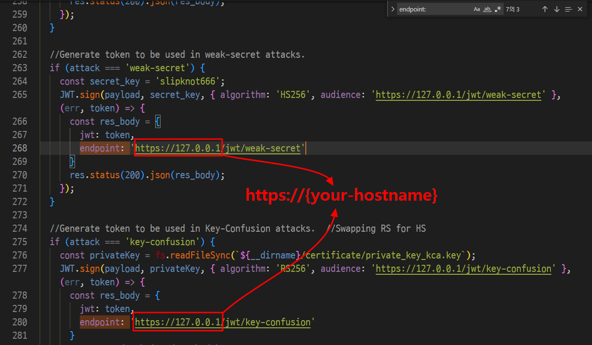
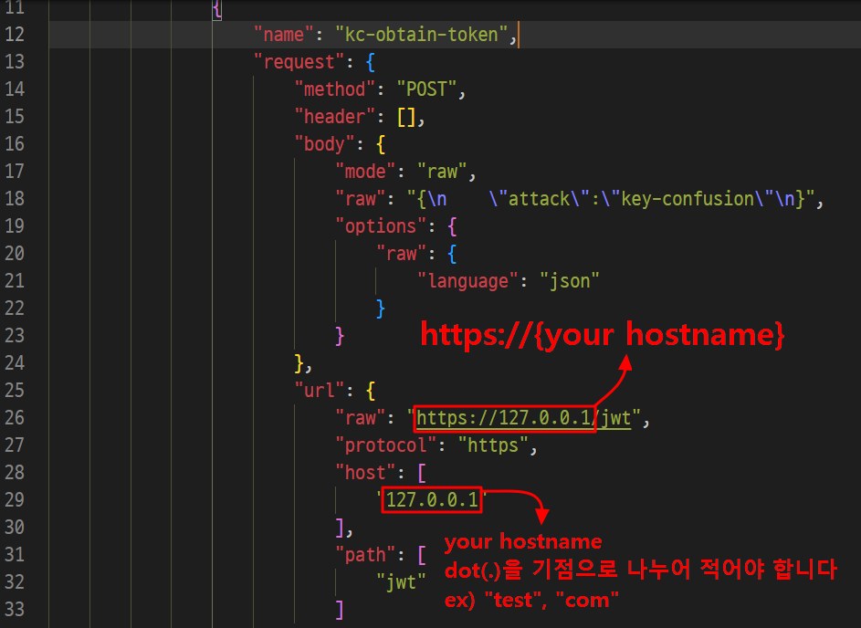
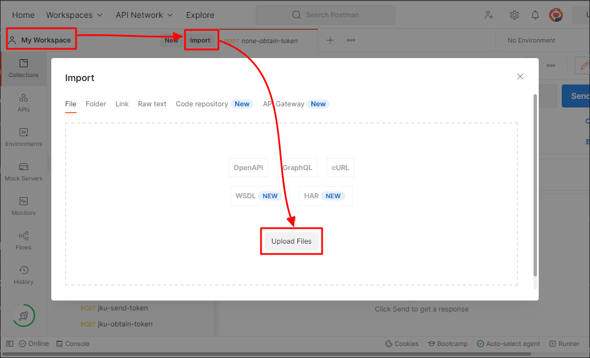
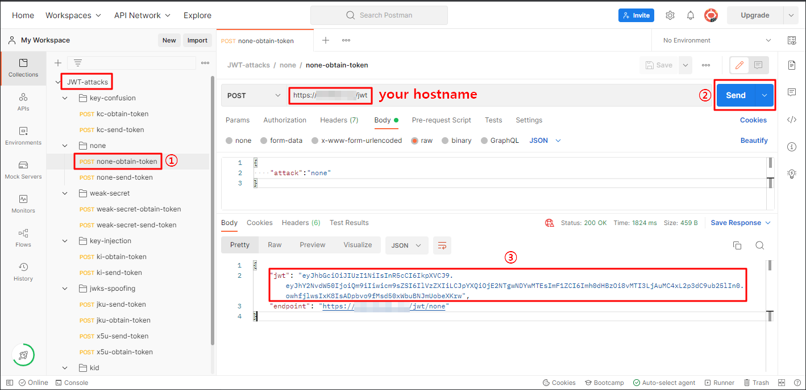
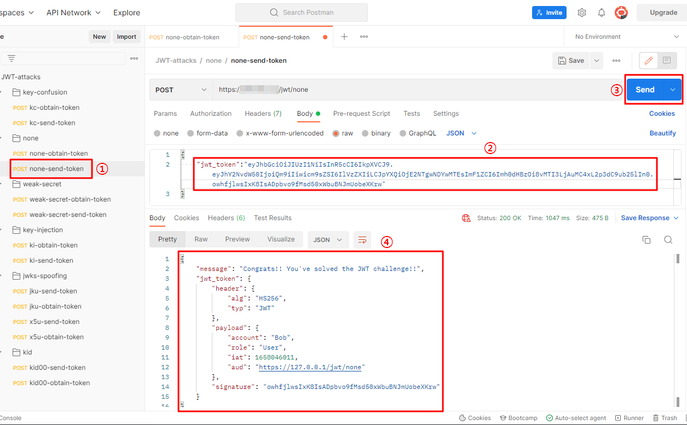

JSON Web Token (이하 JWT) 취약점을 실습할 수 있는 환경을 구축해보고자 합니다.

[PentesterLab](https://pentesterlab.com/exercises/jwt/course)에서 JWT 취약점을 실습해볼 수는 있지만 유료이기도하고 BurpSuite가 아닌, 
API 테스트 도구를 이용해서도 공격을 해보고자 아래와 같은 환경을 구축합니다.

> - 서버 : 오라클 클라우드 CentOS 8 (로컬 가상머신도 가능함)
> - 어플리케이션 : [jwt-hacking-challenges ](https://github.com/onsecru/jwt-hacking-challenges) (Node.js)
> - 공격 도구 1 : [PostMan](https://www.postman.com)
> - 공격 도구 2 : [JWT_Tool](https://github.com/ticarpi/jwt_tool) (Python 3)

# 01. 서버 어플리케이션 구축

**✔ Step 1)** 우선 CentOS 등 리눅스 서버를 개설합니다. 필자는 오라클 클라우드에서 CentOS 8로 개설하였습니다. 로컬에서 VM으로 개설하셔도 상관없습니다.

[오라클 클라우드 인스턴스 생성](https://iter.kr/%EC%98%A4%EB%9D%BC%ED%81%B4-%ED%81%B4%EB%9D%BC%EC%9A%B0%EB%93%9C-%EC%9D%B8%EC%8A%A4%ED%84%B4%EC%8A%A4-%EC%83%9D%EC%84%B1/) 후 [고정 IP 설정](https://iter.kr/%EC%98%A4%EB%9D%BC%ED%81%B4-%ED%81%B4%EB%9D%BC%EC%9A%B0%EB%93%9C-%EA%B3%A0%EC%A0%95ip-%EC%83%9D%EC%84%B1/)을 해줍니다. (링크 참고, ITer님 감사합니다 😄)

참고로, 현재 오라클 클라우드는 무료 서버를 무기한 제공하므로 테스트 시에 유용합니다.

**✔ Step 2)** 서버에 Node.js 환경을 구축합니다.
```
$ sudo dnf groupinstall "Development Tools"
$ sudo dnf install update (권장)
$ sudo dnf module install nodejs
$ sudo node -v
```
**✔ Step 3)** [jwt-hacking-challenges ](https://github.com/onsecru/jwt-hacking-challenges)에서 어플리케이션을 받은 후 '_jwt-hacking-challenges-master\jwt-signature-apis-challenges_' 경로 내 '_app.js_' 소스 코드의 모든 '**endpoint :**' 부분을 'Step 1'에서 구축한 서버의 **IP(HostName)** 으로 변경합니다.



**✔ Step 4)** 'Step 3'에서 수정한 어플리케이션을 서버로 옮긴 후 아래 명령어를 실행하면 취약한 JWT 서버가 구동됩니다.
```
$ cd jwt-hacking-challenges/jwt-signature-apis-challenges
$ sudo npm install
$ sudo node app.js
```
# 02. API 공격 환경 구성 및 요청
**✔ Step 1)** 'jwt-hacking-challenges' 어플리케이션 폴더 내의 'JWT-attacks.postman_collection.json' 파일에서 "raw", "host" 부분을 자신의 서버 HostName으로 수정합니다.



**✔ Step 2)** [PostMan](https://www.postman.com/) 가입, 로그인 후 'My Workspace > import'에서 'JWT-attacks.postman_collection.json'을 불러옵니다.



**✔ Step 3)** '**JWT-attacks**' 내에서 ① '**...-optain-token**' API 요청은 토큰을 획득하는 패킷을 보내며 _HostName_ 확인 후 ② 'Send'를 누르면 서버에서 ③ JWT를 받아옵니다.



**✔ Step 4)** ① '**...-sent-token**'은 획득한 JWT를 이용해 실제 공격 요청을 보내는 항목입니다. ② 'Step 3'에서 획득한 JWT를 파라미터에 입력하고 ③ 요청하면 ④ 보낸 JWT가 유효한 것을 확인할 수 있습니다.



토큰이 유효하지 않을 경우, 아래와 같이 에러를 받습니다.
```
{
    "name": "JsonWebTokenError",
    "message": "invalid signature"
}
```

**✔ Step 5)** [JWT_Tool](https://github.com/ticarpi/jwt_tool) 또한 공격 환경에 준비해 놓습니다. JWT 관련 취약점 공격 시에 유용하게 사용됩니다.

# 💥 03. 활용
[JSON Web Token - 취약점 알아보기]() 글에서 JWT의 각 취약점 Exploitation에서 사용합니다.
